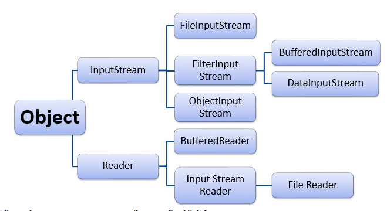
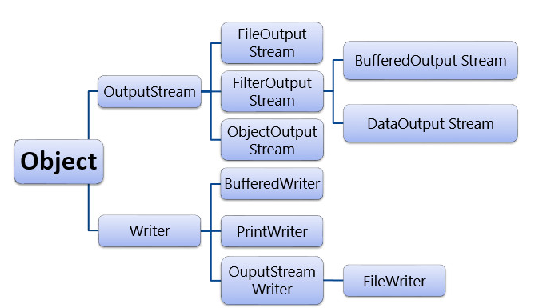

# [BUỔI 10] NHẬP XUẤT FILE, UNIT TEST
---
## 1. Xử lí file trong Java

### 1.1. File
- Để thao tác với File cần khai báo package `java.io.File`.
- Cú pháp khai báo:
```Java
File file = new File(String pathName);
```
Example: 
```Java
File file = new File("D:\\NewFile.txt");
```
- Các phương thức của File:
    - boolean `exist()`: Kiểm tra file có tồn tại không.
    - String `getName()`: lấy tên file (*input-file.txt*).
    - String `getParent()`: lấy đường dẫn thư mục của file.
    - String `getPath()`: đường dẫn đầy đủ.
    - boolean `isDirectory()`: kiểm tra xem là thư mục hay không.
    - boolean `isFile()`: kiểm tra xem là file hay không.
    - long `length()`: cỡ file (byte).

```Java
import java.io.File;
public class Main {
    public static void main(String[] args) {
        File file = new File("C:\\Users\\thamb\\Java\\Example\\file.txt");
        if(file.exists()) System.out.println("File đã tồn tại");
        else System.out.println("File không tồn tại");
        System.out.println(file.getName());
        System.out.println(file.getPath());
        System.out.println(file.length());
    }
}
```
```Java
File đã tồn tại
file.txt
C:\Users\thamb\Java\Example\file.txt
10
```
- Đọc và ghi file trong java là các hoạt động nhập/xuất dữ liệu (nhập dữ liệu từ bàn phím, đọc dữ liệu từ file, ghi dữ liệu lên màn hình, ghi ra file, ghi ra đĩa, ghi ra máy in…) đều được gọi là **luồng** (stream).
    - Luồng nhập dữ liệu:
    
    - Luồng xuất dữ liệu: 
    

- Các thao tác xử lý dữ liệu:
    - **Bước 1**: Tạo đối tượng luồng và liên kết với nguồn dữ liệu.
    - **Bước 2**: Thao tác dữ liệu (đọc hoặc ghi hoặc cả hai).
    - **Bước 3**: Đóng luồng.

### 1.2. TextFile
- Là một loại tệp tin chứa dữ liệu văn bản được lưu trữ trong định dạng văn bản thuần túy, tức là dữ liệu được lưu trữ dưới dạng chuỗi các ký tự.
- Lớp `FileReader` nằm trong package java.io có thể được sử dụng để đọc dữ liệu là các ký tự (character) từ file. Lớp `FileReader` kế thừa từ lớp `InputSreamReader`.
- Lớp `FileWriter` nằm trong package `java.io` được sử dụng để ghi dữ liệu là các ký tự (character) vào file. Lớp `FileWriter` kế thừa từ lớp `OutputStreamWriter`.
```Java
// Main.java
import java.io.File;
import java.io.FileReader;
import java.io.FileWriter;
import java.io.IOException;

public class Main {
    public static void main(String[] args) throws IOException {
        File file = new File("C:\\Users\\thamb\\Java\\Example\\file.txt");
        FileWriter writer = new FileWriter(file);
        writer.write("Phan Thắm");
        writer.close();

        FileReader reader = new FileReader(file);
        reader.read();
        reader.close();
    }
}
```
```Java
// file.txt
Phan Thắm
```
### 1.3. Binary File
- Là một loại tệp tin chứa dữ liệu không phải là văn bản, mà là các dữ liệu nhị phân. Điều này có nghĩa là dữ liệu được lưu trữ dưới dạng các byte không được mã hóa thành các ký tự văn bản.
-Lớp `FileInputStream` trong package `java.io` có thể được sử dụng để đọc dữ liệu (dạng byte) từ file. Lớp này kế thừa từ lớp abstract `InputStream`.
- Lớp `FileOutputStream` trong package `java.io` có thể được sử dụng để ghi dữ liệu (dạng byte) từ file. Lớp này kế thừa từ lớp abstract `OutputStream`.
```Java
// Main.java
import java.io.*;

public class Main {
    public static void main(String[] args) throws IOException {
        String filePath = "Test.bin";
        String s = "Hello";
        FileOutputStream fos = new FileOutputStream(filePath);
        fos.write(s.getBytes());
        fos.close();

        FileInputStream fis = new FileInputStream(filePath);
        while(fis.available()!=0){
            System.out.println(fis.read());
        }
    }
}
```
```Java
//cmd
72
101
108
108
111
```
```Java
// Test.bin
Hello
```
## 2. Assertions
- **Assertion** trong  Java cho phép chúng ta kiểm tra tính đúng đắn của bất kỳ giả định nào đã được thực hiện trong chương trình. Nếu xác nhận không thành công, thì JVM sẽ ném ra lỗi AssertionError. 
### 2.1. Kích hoạt khẳng định
\- Cú pháp:
```Java
assert condition;
```
Hoặc
```Java
assert condition : expression;
```
*condition* là một biểu thức boolean mà chúng ta giả sử là đúng khi chương trình thực thi.

\- Theo mặc định, các **assertions** bị tắt và bị bỏ qua trong thời gian chạy. Để bật **assert** , chúng ta sử dụng:
```Java
java -ea:arguments
```
Hoặc
```Java
java -enableassertions:arguments
```
\- Khi các **Assertion** được kích hoạt và điều kiện là `true`, chương trình sẽ thực thi bình thường. Nhưng nếu điều kiện là `false`, JVM sẽ đưa ra một lỗi `AssertionError` và chương trình sẽ dừng ngay lập tức.
```Java
import java.io.*;

public class Main {
    public static void main(String[] args) {
        int x=10;
        int y=11;
        assert x==y : "x khác y";
        System.out.println("Đúng");
    }
}
```
### 2.2. Tại sao cần sử dụng Assertions
- Nhanh chóng và hiệu quả để phát hiện và sửa lỗi.
- Kiểm tra xác nhận chỉ được thực hiện trong quá trình phát triển và thử nghiệm. Chúng tự động bị xóa trong code release trong thời gian chạy để không làm chậm quá trình thực thi chương trình.
- Nó giúp loại bỏ code viết sẵn và làm cho code dễ đọc hơn.
- Cơ cấu lại và tối ưu hóa mã với độ tin cậy cao hơn rằng nó hoạt động chính xác.

## 3. Unit Test
- Unit Test có nghĩa là kiểm thử đơn vị, một bước trong kiểm thử phần mềm. Với Unit Test, chỉ có những đơn vị hay những thành phần riêng lẻ của phần mềm được kiểm thử. Mục đích là để xác định rằng mỗi đơn vị của phần mềm đều hoạt động đúng như kỳ vọng.
- Tầm quan trọng của Unit Test:
    - Làm giảm tổng số lỗi trong quá trình code.
    - Làm cho dòng code của bạn trở lên dễ bảo trì và tái sử dụng hơn.
    - Giúp sửa bug sớm trong chu trình phát triển sản phẩm và tiết kiệm chi phí và thời gian
    - Có thể xây dựng một bộ kiểm thử bao gồm nhiều các test khác nhau có thể chạy trong bất cứ thời gian nào.
    

