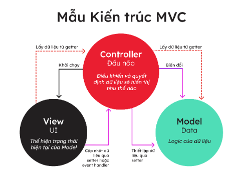
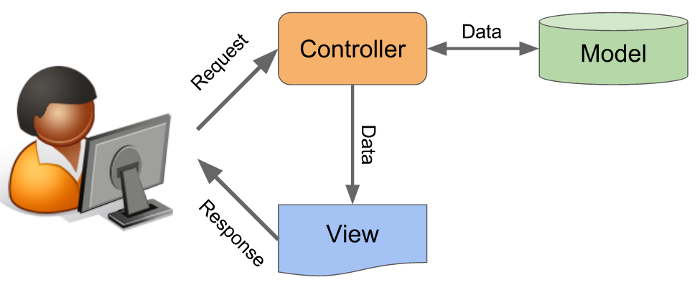

# [Buổi 11] CÁC NGUYÊN TẮC THIẾT KẾ, MÔ HÌNH THIẾT KẾ
----
## 1. SOLID là gì?
\- SOLID là viết tắt của 5 chữ cái đầu trong 5 nguyên tắc thiết kế hướng đối tượng, giúp cho developer viết ra những đoạn code dễ đọc, dễ hiểu, dễ maintain, được đưa ra bởi **Bob Martin** và **Michael Feathers**. 5 nguyên tắc đó bao gồm:
- **S**ingle responsibility priciple (SRP)
- **O**pen/Closed principle (OCP)
- **L**iskov substitution principe (LSP)
- **I**nterface segregation principle (ISP)
- **D**ependency inversion principle (DIP)

### 1.1. Single responsibility principle (SRP - Nguyên lý đơn nhiệm).
> ***"Mỗi lớp chỉ nên chịu trách nhiệm duy nhất một nhiệm vụ".***

- Một class có quá nhiều chức năng sẽ trở nên cồng kềnh và trở nên khó đọc, khó maintain.
- Nguyên lý SRP cho phép chúng ta chia nhỏ và phân tách các thành phần trong phần mềm thành các đơn vị độc lập, mỗi đơn vị chỉ chịu trách nhiệm cho một nhiệm vụ cụ thể.
- Example:
```Java
public class Student {
    private String name;
    public void setName(String name) {
        this.name = name;
    }
    public String getName() {
        return name;
    }
    public void print(){
        // in ra thông tin sinh viên
    }
}
```
Ở đây ta có thể tách phương thức `print()` ra thành 1 class Work.
```Java
public class Work{
    public void print(){
        // in ra thông tin sinh viên
    }
}
```
### 1.2. Open-Closed principle (OCP) – Nguyên lý đóng mở
> ***"Có thể thoải mái mở rộng 1 class, nhưng không được sửa đổi bên trong class đó."***
- Theo nguyên lý này, mỗi khi ta muốn thêm chức năng cho chương trình, chúng ta nên viết class mới mở rộng class cũ (bằng cách kế thừa hoặc sở hữu class cũ) chứ không nên sửa đổi class cũ.
- Lợi ích của nguyên lý này là chúng ta không phải lo lắng về code sử dụng các class nguồn mà chỉ tập trung vào các class mới bởi vì chúng ta đã không sửa đổi chúng.
```Java
public class Student{
    private String name;
    private int age;
    private float gpa;
    public Student(String name, int age, float gpa){
        this.name = name;
        this.age = age;
        this.gpa = gpa;
    }
}
```
Để thêm msv cho Student, ta tuân theo nguyên tắc Mở/Đóng:
```Java
public class UpdateMsv extends Student {
    private String msv;
    public UpdateMsv(String name, int age, float gpa) {
        super(name, age, gpa);
        this.msv = msv;
    }
}
```
### 1.3. Liskov substitution principle (LSP) – Nguyên lý thay thế
> ***"Trong một chương trình, các object của class con có thể thay thế class cha mà không làm thay đổi tính đúng đắn của chương trình."***
- Theo nguyên lý LS, một lớp con nên thừa hưởng các thuộc tính và phương thức từ lớp cha, đồng thời cũng cần phải tuân thủ tất cả các quy tắc và hành vi của lớp cha. Nghĩa là, khi một đối tượng được khởi tạo từ lớp con, nó cần có thể thực hiện tất cả các chức năng mà đối tượng từ lớp cha có thể thực hiện một cách như nhau.

- Việc áp dụng nguyên lý LS giúp cho các lớp trong chương trình trở nên linh hoạt và dễ dàng mở rộng. Nó giúp đảm bảo tính đúng đắn của chương trình khi có sự thay đổi ở cấp độ lớp con, đồng thời giúp giảm thiểu các lỗi liên quan đến sự không tương thích giữa các lớp.
## 2. KISS, DRY, YAGNI
### 2.1.KISS
> ***"Keep It Simple, Stupid"***

\- Là nguyên tắc được được đặt ra bởi Kelly Johnson, với ý nghĩa nhấn mạnh tầm quan trọng của sự đơn giản trong các đoạn code. 

\- Đoạn code càng đơn giản thì khả năng để đọc và hiểu được đoạn code đó càng nhanh, càng đơn giản càng dễ dàng để bảo trì cũng như thay đổi trong tương lai, việc này sẽ giúp tiết kiệm thời gian hơn rất nhiều.

\- Áp dụng vào code:
+ Đặt tên hàm, biến, method, class, package, comment rõ nghĩa.
+ Chia vấn task của bạn thành các task nhỏ hơn để code 1 cách rõ ràng.
+ Giới hạn mỗi method chỉ nên từ 30-50 lines, và mỗi method chỉ nên thực hiện 1 chức năng.
+ Hiểu rõ các vấn đề trước khi code.
+ Không nên sử dụng nhiều câu lệnh If trong 1 method, hãy tách nó ra thành các method khác nhau.

### 2.2. DRY
> ***"Don’t Repeat Yourself"*** - Đừng bao giờ lặp lại code.

\- Đừng lặp lại code ở đây là không lặp lại các đoạn code giống nhau, các method thực hiện chức năng như nhau, cố gắng gom chúng lại 1 cách gọn gàng và có thể dùng lại khi cần.
### 2.3. YAGNI
> ***"You Aren't Gonna Need It"*** - Bạn không cần nó.

\- Là nguyên tắc chú trọng đến việc không nên làm phức tạp hóa một yêu cầu bằng các giả định trong tương lai. Hay nói cách khác là đừng giả định và xây dựng các chức năng của một phần mềm trước khi cần dùng tới nó.

\- Việc giả định các chức năng và code chúng sẽ gây ra rất nhiều sự lãng phí về thời gian, tiền bạc cũng như công sức của team (review code, testing, ...) và đôi khi sẽ không thu lại được gì (Khi chức năng đó trong tương lai không hề cần thiết). Do đó chỉ nên dành thời gian phát triển các chức năng cần thiết ở hiện tại.

## 3. Mô hình MVC
- **MVC** là viết tắt của cụm từ “**Model** - **View** - **Controller**“. Đây là mô hình thiết kế được sử dụng trong kỹ thuật phần mềm. MVC là một mẫu kiến trúc phần mềm để tạo lập giao diện người dùng trên máy tính. MVC chia thành ba phần được kết nối với nhau và mỗi thành phần đều có một nhiệm vụ riêng của nó và độc lập với các thành phần khác. Tên gọi 3 thành phần:
    - **Model** (*dữ liệu*): Quản lí xử lí các dữ liệu.
    - **View** (*giao diện*): Nới hiển thị dữ liệu cho người dùng.
    - **Controller** (*bộ điều khiển*): Điều khiển sự tương tác của hai thành phần Model và View.


- **Model:** Là bộ phận có chức năng lưu trữ toàn bộ dữ liệu của ứng dụng và là cầu nối giữa 2 thành phần bên dưới là View và Controller. Một model là dữ liệu được sử dụng bởi chương trình. Đây có thể là cơ sở dữ liệu, hoặc file XML bình thường hay một đối tượng đơn giản. Chẳng hạn như biểu tượng hay là một nhân vật trong game.
- **View:** Đây là phần giao diện (theme) dành cho người sử dụng. View là phương tiện hiển thị các đối tượng trong một ứng dụng. Chẳng hạn như hiển thị một cửa sổ, nút hay văn bản trong một cửa sổ khác. Nó bao gồm bất cứ thứ gì mà người dùng có thể nhìn thấy được.
- **Controller:** Là bộ phận có nhiệm vụ xử lý các yêu cầu người dùng đưa đến thông qua View. Một controller bao gồm cả Model lẫn View. Nó nhận input và thực hiện các update tương ứng.
### Luồng xử lí trong MVC
- Khi một yêu cầu của từ máy khách (Client) gửi đến Server. Thì bị **Controller** trong MVC chặn lại để xem đó là URL request hay sự kiện.
- Sau đó, **Controller** xử lý input của user rồi giao tiếp với **Model** trong MVC.
- **Model** chuẩn bị data và gửi lại cho **Controller**.
- Cuối cùng, khi xử lý xong yêu cầu thì **Controller** gửi dữ liệu trở lại **View** và hiển thị cho người dùng trên trình duyệt.

> **View không giao tiếp trực tiếp với Model**. Sự tương tác giữa **View** và **Model** sẽ chỉ được xử lý bởi **Controller**.

