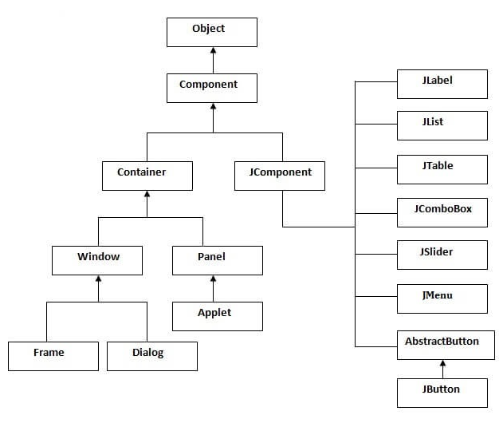
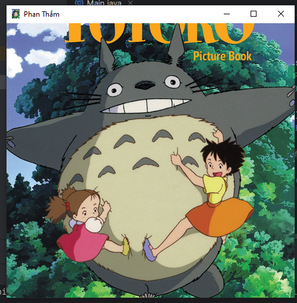

# [BUỔI 12] THƯ VIỆN ĐỒ HỌA SWING
---

## 1. Thư viện đồ họa Swing cơ bản
\- **Swing** trong Java là một bộ công cụ **Giao diện Người dùng Đồ họa** (**GUI - Graphical User Interface**) bao gồm các thành phần GUI. 

\- Thư viện **Java Swing** được xây dựng dựa trên Bộ công cụ tiện ích con trừu tượng Java (**AWT -  Abstract Widget Toolkit** ). Tuy nhiên, nó lại khác với AWT ở chỗ bộ công cụ này thuộc loại **nền tảng độc lập**, bao gồm các thành phần **nhẹ hơn** AWT.

\- Gói `javax.swing` cung cấp các lớp cho java swing API như JButton, JTextField, JTextArea, JRadioButton, JCheckbox, JMenu, JColorChooser,...
### 1.1. Phân cấp các lớp Java Swing

- Mỗi thành phần trong Swing được gọi là **component**. Tất cả các component trong **Java Swing** là **JComponent** có thể được thêm vào container class (lớp vùng chứa).
- **Container class** (lớp vùng chứa) là các class có thể chứa các component khác trên đó. Vì vậy, để tạo Java GUI, chúng ta cần ít nhất một container object (đối tượng vùng chứa). **Java Swing** có 3 loại container:
    - *Panel* (bảng điều khiển): là một container thuần túy và thực chất không phải là một window (cửa sổ). Mục đích duy nhất của Panel là tổ chức các component trên một window.
    - *Frame* (khung): là một window hoàn chỉnh có đầy đủ *title* (tiêu đề) và các *icon* (biểu tượng).
    - *Dialog* (hộp thoại): có thể được coi như một *pop-up window* sẽ bật ra khi một tin nhắn cần được hiển thị. Nó không phải là window hoàn chỉnh như *Frame*.
### 1.2.Các phương thức thường dùng của lớp Component


---
## 2. Một số Component trong Java Swing
### 2.1 JFrame
- ***Đặc điểm***:
    - Là một cửa sổ có tiêu đề, viền, thanh menu ( tùy chọn ) và các thành phần được chỉ định khác
    - Nó có thể di chuyển, thay đổi kích thước và có icon đại diện
    - Nó thường được dùng để chứa các thành phần giao diện khác ( Button, Label, … )
- ***Tạo 1 JFrame***:
    - `JFrame()`: Khởi tạo 1 Frame mới invisible.
    - `JFrame(GraphicsConfiguration qc)`: Tạo một Frame được chỉ địnhGraphicsConfiguration của màn hình thiết bị và Title trắng.   ***
    - `JFrame(String title)`: Tạo một frame mới invisibile với tiêu đề được chỉ định.
    - `JFrame(String title, GraphicsConfiguration qc)`: Tạo một Frame được chỉ định tiêu đề và GraphicsConfiguration của màn hình thiết bị.   ***
- ***Một số phương thức cơ bản của JFrame*** :
    - `setSize(int width,int height)`: Đặt kích thước cho JFrame.
    - `setLocation(int x,int y)`: Đặt vị trí cho JFrame.(Mặc định thì một JFrame sẽ hiển thị ở vị trí **góc trên – trái** của màn hình.)
    - `setBounds(int x, int y, int width, int height)`:Cách sử dụng nhanh, gộp 2 hàm ở trên lại thành 1.
    - `setVisible(boolean b)`: Đặt JFrame ẩn/hiện.
        - **True**: Xuất hiện
        - **False**: Ẩn đi
    - `setDefaultCloseOperation(int operation)`: Đặt hành động mặc định sẽ xảy ra khi người dùng “close” Frame. 
        - Mặc định là **HIDE_ON_CLOSE**(1): Frame sẽ bị ẩn đi khi người dùng đóng nó lại. Chương trình vẫn sẽ hoạt động bình thường trong khi JFrame này bị ẩn. 
        - **DO_NOTHING_ON_CLOSE**(0): Không làm thêm bất cứ điều gì khi JFrame bị đóng.
        - **DISPOSE_ON_CLOSE**(2): Sau khi bị đóng lại, nó đồng thời sẽ bị dọn dẹp rác, các tài nguyên được JFrame này sử dụng sẽ bị thu hồi nhường chỗ cho những nơi khác sử dụng.
        - **EXIT_ON_CLOSE**(3): Sau khi JFrame bị đóng, chương trình cũng sẽ tắt theo.
    - `setTitle(String title)`: Đặt tiêu đề cho JFrame
    - `setResizable(boolean b)`: Đặt JFrame có được thay đổi kích thước hay không
- Ví dụ:
```Java
import javax.swing.JFrame;

public class Main {
    public static void main(String[] args) {
        JFrame jframe = new JFrame();
        jframe.setSize(1000,500);
        jframe.setLocation(50,100);
        jframe.setBounds(100,100,1000,500);
        jframe.setTitle("Phan Thắm");
        jframe.setVisible(true);
        jframe.setDefaultCloseOperation(JFrame.EXIT_ON_CLOSE);
    }
}
```


### 2.2. JButton
- ***Đặc điểm***: Cho phép người dùng click vào để kích hoạt một hành động được chỉ định.
- ***Hàm tạo của JButton***:
    - `JButton()`: Tạo một Button không có text hoặc icon
    - `JButton(Action a)`: Tạo một button tại đây các thuộc tính được nhận từ Action đã cung cấp.
    - `JButton(Icon icon)`: Tạo một button với một icon.
    - `JButton(String text)`: Tạo một button với text.
    - `JButton(String text, Icon icon)`: Tạo một button với text ban đầu và một icon.
- ***Một số phương thức của JButton***:
    - `setBounds()`: Khởi tạo kích thước, vị trí.
    - `setText(String s)`: được sử dụng để thiết lập text đã cho trên button.
    - `getText()`: được sử dụng để trả về text của button.
    - `setEnabled(boolean b)`: được sử dụng để kích hoạt hoặc vô hiệu hóa button.
    - `setIcon(Icon b)`: được sử dụng để thiết lập Icon đã cho trên button.
    - `getIcon()`: được sử dụng để lấy Icon của button.
    - `setMnemonic(int a)`: được sử dụng để thiết lập thuộc tính mnemonic trên button.
        - Tạo phím tắt trong Button: Ví dụ tạo phím nhớ **ALT + E** để gọi đến sự kiện nhấp vào Button.
        - `button.setMnemonic(KeyEvent.VK_E);`
    - `addActionListener(ActionListener a)`: được sử dụng để thêm action listener tới đối tượng này.
    - `setBackground(color):` Thay đổi màu nền của Button.
    - `setFont(font)`: Xác định Font, cỡ chữ của Button.
- Ví dụ:
```Java
public class Main {
    public static void main(String[] args) {
        JFrame frame = new JFrame("Phan Thắm");
        frame.setBounds(100,100,1000,500);
        frame.setVisible(true);
        frame.setDefaultCloseOperation(JFrame.EXIT_ON_CLOSE);

        JButton button = new JButton("Click");
        button.setBounds(150,150,50,25);
        frame.add(button);
        button.setMnemonic(KeyEvent.VK_C);
        button.addActionListener(new ActionListener() {
            @Override
            public void actionPerformed(ActionEvent x) {
                button.setText("Bạn đã Click");
                button.setFont(new java.awt.Font("Lora",Font.BOLD,20));
            }
        });
    }
}
```


### 2.3. JLabel
- ***Đặc điểm***: 
    - Có nguồn gốc từ JComponent, được dùng để tạo một nhãn văn bản
    - Cung cấp text chỉ dẫn hoặc thông tin trên giao diện người dùng : hiển thị một dòng đơn text chỉ đọc , một hình ảnh hoặc cả text và hình ảnh.
    - Chúng ta thường sử dụng JLabel khi cần tạo một thành phần giao diện người dùng hiển thị một thông điệp hoặc một hình ảnh.
- ***Các hàm tạo của JLabel***:
    - `JLabel()`: Tạo một instance của JLabel, không có hình ảnh, và với một chuỗi trống cho title.
    - `JLabel(Icon image)` : Tạo một JLabel với hình ảnh đã cho.
    - `JLabel(Icon image, int horizontalAlignment)`: Tạo một JLabel với hình ảnh và căn chỉnh ngang đã cho.
    - `JLabel(String text)`: Tạo một JLabel với text đã cho.
    - `JLabel(String text, Icon icon, int horizontalAlignment)`: Tạo một JLabel với text, hình ảnh, và căn chỉnh ngang đã cho.
    - `JLabel(String text, int horizontalAlignment)`: Tạo một JLabel với text và căn chỉnh ngang đã cho.
- ***Một số phương thức cơ bản của JLabel***:
    - `setText(String text)`: Đặt giá trị text cho JLabel
    - `getText()` : Lấy giá trị text của JLabel
    - `setToolTipText(String text)`: Đặt Tooltip cho JLabel ( Khi di chuột trên Label sẻ hiển thị text tip )
    - `setForeground(Color fg)`: Đặt màu cho chữ
    - `setIcon(Icon icon)`: Đặt icon cho JLabel
    - `setSize(int width, int height)` : Đặt kích thước cho JLable
- ***VD***:
```Java
public class Main {
    public static void main(String[] args) {
        JFrame frame = new JFrame("Phan Thắm");
        frame.setBounds(100,100,500,250);
        frame.setVisible(true);
        frame.setDefaultCloseOperation(JFrame.EXIT_ON_CLOSE);

        JLabel label = new JLabel("Hello");
        label.setForeground(Color.RED);
        label.setToolTipText("Xin chào");
        frame.add(label);
    }
}
```


### 2.4. JTextField
- ***Đặc điểm***: Cho phép chỉnh sửa/hiển thị một dòng text đơn, có thể được căn lề trái, phải hoặc chính giữa hay đặt font cho text.
- ***Các hàm tạo của JTextField***:
    - `JTextField()`: Xây dựng một TextField mới.
    - `JTextField(Document doc, String text, int columns)`: Xây dựng một JTextField mới mà sử dụng mô hình lưu trữ text đã cho và số cột đã cho.
    - `JTextField(int columns)`: Xây dựng một TextField mới và trống với số cột đã cho.
    - `JTextField(String text)`: Xây dựng một TextField mới được khởi tạo với text đã cho.
    - `JTextField(String text, int columns)`: Xây dựng một TextField mới được khởi tạo với text và các cột đã cho.
- ***Một số phương thức của JTextField***:
    - `setText(String text)`: Thiết lập text.
    - `getTex()`: Lấy dòng text.
    - `setEditable(boolean)`: Thiết lập chế độ chỉnh sửa text.
    - `setColumns(int columns)`: Thiết lập số cột.
    - `getColumns()`: Lấy số cột
    - `setToolTipText(String text)`: Đặt ToolTipText cho JTextField.
- ***VD***:
```Java
public class Main {
    public static void main(String[] args) {
        JFrame frame = new JFrame("Phan Thắm");
        frame.setBounds(100,100,1000,500);
        frame.setVisible(true);
        frame.setDefaultCloseOperation(JFrame.EXIT_ON_CLOSE);

       JTextField text = new JTextField("Hello");
       text.setEditable(false); // ko cho chỉnh sửa
       frame.add(text);
    }
}
```


### 2.5. JTable
- ***Đặc điểm***: được sử dụng để hiển thị và chỉnh sửa dữ liệu theo dạng Table (Dữ liệu được trình bày theo dạng hàng và cột). Nó tương tự như một bảng tính trong excel file.
- ***Hàm khởi tạo***:
    - `JTable()`: Khởi tạo một JTable rỗng.   
    - `JTable(int rows, int cols)`: Khởi tạo một JTable với số dòng và cột được chỉ định.
    - `JTable(Object[][] rows, Object[] columns)`: Tạo một bảng với dữ liệu đã cho.
- ***Một số phương thức của JTable***:
    - `addColumn(TableColumn column)`: Thêm một cột vào cuối bảng.
    - `setValueAt(Object value, int row, int col)`: Cập nhật giá trị tạo ô có số cột là col và hàng row thành giá trị value mới. 
    - `setAutoCreateRowSorter()`: Sắp xếp dữ liệu trong JTable.
- ***VD***:
```Java
public class Main {
    public static void main(String[] args) {
        JFrame frame = new JFrame("Phan Thắm");
        frame.setSize(200,200);
        frame.setVisible(true);
        frame.setLocationRelativeTo(null);
        frame.setDefaultCloseOperation(JFrame.EXIT_ON_CLOSE);

        String[] title = {"Name","Date"};
        Object[][] data = {{"JK","1997"} , {"JHope","1994"} , {"Jimin","1995"} , {"V","1995"} , {"Suga","1993"} , {"RM","1994"} , {"Jin","1992"}};
        JTable table = new JTable(data,title);
        JScrollPane sp = new JScrollPane(table); //Hiện thị tiêu đề
        table.setAutoCreateRowSorter(true);
        frame.add(sp);
    }
}
```


### 2.6. JList
- ***Đặc điểm***: là một thành phần mà hiển thị một danh sách các đối tượng và cho phép người dùng lựa chọn một hoặc nhiều item.
- ***Hàm khởi tạo JList***:
    - `JList()`: Tạo JList rỗng.
    - `JList(ListModel dataModel)`: Xây dựng một JList mà hiển thị các phần tử từ model đã cho và non-null.
    - `JList(Object[] listData)`: Xây dựng một JList mà hiển thị các phần tử trong mảng đã cho. 
    - `JList(Vector listData)`: Xây dựng một JList mà hiển thị các phần tử trong Vector đã cho.
- ***Một số phương thức của JList***:
!
- ***VD***:
```Java
public class Main {
    public static void main(String[] args) {
        JFrame frame = new JFrame("Phan Thắm");
        frame.setSize(200,200);
        frame.setVisible(true);
        frame.setLocationRelativeTo(null);
        frame.setDefaultCloseOperation(JFrame.EXIT_ON_CLOSE);

        String[] week = {"Monday","Tuesday","Wednesday","Thursday","Friday","Saturday","Sunday"};
        JList list = new JList(week);
        list.setSelectedIndex(3);
        list.getSelectedValue();
        list.setSelectionBackground(Color.pink);
        list.setSelectionForeground(Color.RED);
        frame.add(list);
    }
}
```


---
## 3. Layout trong Java Swing
Layout trong Java Swing được sử dụng để chỉ định bố cục các thành con bên trong một container.

Có thể set Layout Manager cho container thông qua phương thức setLayout

Nếu setLayout cho container là null, ta có thể tùy chỉnh các thành phần.
```Java
public class Main {
    public static void main(String[] args) {
        JFrame frame = new JFrame("Phan Thắm");
        frame.setSize(200,200);
        frame.setVisible(true);
        frame.setLocationRelativeTo(null);
        frame.setDefaultCloseOperation(JFrame.EXIT_ON_CLOSE);
        frame.setLayout(null);

        JButton button = new JButton("Click");
        button.setBackground(Color.GREEN);
        button.setBounds(50,50,100,100);
        frame.add(button);
    }
}
```


### 3.1. BorderLayout
- BorderLayout tổ chức các thành phần con thành 5 vùng **NORTH, SOUTH, EAST, WEST and CENTER**. Ở mỗi vùng chỉ có thể chứa tối đa một thành phần con, khi thêm các phần tử khác nhau vào BorderLayout bạn cần chỉ định 1 trong 5 vùng trên.

- ***VD***:
```Java
public class Main {
    static void align(JLabel label){
        label.setBorder(BorderFactory.createLineBorder(Color.BLACK));
        label.setHorizontalAlignment(JLabel.CENTER);
    }
    public static void main(String[] args) {
        JFrame frame = new JFrame("Phan Thắm");
        frame.setSize(500,500);
        frame.setVisible(true);
        frame.setLocationRelativeTo(null);
        frame.setDefaultCloseOperation(JFrame.EXIT_ON_CLOSE);

        JLabel north = new JLabel("North"); align(north);
        JLabel south = new JLabel("South"); align(south);
        JLabel east = new JLabel("East"); align(east);
        JLabel west = new JLabel("West"); align(west);
        JLabel center = new JLabel("Center"); align(center);
        north.setForeground(Color.RED);
        south.setForeground(Color.RED);
        east.setForeground(Color.RED);
        west.setForeground(Color.RED);
        center.setForeground(Color.RED);
        frame.add(north,BorderLayout.NORTH);
        frame.add(south,BorderLayout.SOUTH);
        frame.add(east,BorderLayout.EAST);
        frame.add(west,BorderLayout.WEST);
        frame.add(center,BorderLayout.CENTER);
    }
}
```


### 3.2. FlowLayout
- FlowLayout bố trí các thành phần con theo hướng từ trái sang phải hoặc từ phải sang trái trên cùng một dòng. Nếu tất cả các thành phần con không thể chứa trên cùng một dòng so với chiều dài tối đa của container thì chúng sẽ được sắp xếp trên một hàng mới.
- ***VD***:
```Java
public class Main {
    static void align(JLabel label){
        label.setBorder(BorderFactory.createLineBorder(Color.BLACK));
        label.setHorizontalAlignment(JLabel.CENTER);
        label.setForeground(Color.RED);
    }
    public static void main(String[] args) {
        JFrame frame = new JFrame("Phan Thắm");
        frame.setSize(500,500);
        frame.setVisible(true);
        frame.setLocationRelativeTo(null);
        frame.setDefaultCloseOperation(JFrame.EXIT_ON_CLOSE);

        JLabel north = new JLabel("Nort"); align(north);
        JLabel south = new JLabel("South"); align(south);
        JLabel east = new JLabel("East"); align(east);
        JLabel west = new JLabel("West"); align(west);
        JLabel center = new JLabel("Center"); align(center);
        frame.setLayout(new FlowLayout());
        frame.add(north);
        frame.add(south);
        frame.add(east);
        frame.add(west);
        frame.add(center);
    }
}
```


### 3.3. GridLayout
- Trình quản lý GridLayout được sử dụng để bố trí các thành phần trong một lưới hình chữ nhật, lưới này đã được chia thành các hình chữ nhật có kích thước bằng nhau và một thành phần được đặt trong mỗi hình chữ nhật. 
- ***Một số Constructor***:
    - `GridLayout()`: Tạo một grid layout với mặc định là một cột mỗi thành phần, trong một hàng đơn.
    - `GridLayout(int rows, int columns)`: Tạo một grid layout với số hàng và cột đã cho, và không có khoảng cách giữa các thành phần.
    - `GridLayout(int rows, int columns, int hgap, int vgap)`: Tạo một grid layout với các hàng và cột đã cho cùng với các khoảng cách theo chiều dọc và ngang đã xác định.
- ***VD***:
```Java
public class Main {
    static void align(JLabel label){
        label.setBorder(BorderFactory.createLineBorder(Color.BLACK));
        label.setHorizontalAlignment(JLabel.CENTER);
        label.setForeground(Color.RED);
    }
    public static void main(String[] args) {
        JFrame frame = new JFrame("Phan Thắm");
        frame.setSize(500,500);
        frame.setVisible(true);
        frame.setLocationRelativeTo(null);
        frame.setDefaultCloseOperation(JFrame.EXIT_ON_CLOSE);

        JLabel north = new JLabel("Nort"); align(north);
        JLabel south = new JLabel("South"); align(south);
        JLabel east = new JLabel("East"); align(east);
        JLabel west = new JLabel("West"); align(west);
        JLabel center = new JLabel("Center"); align(center);
        GridLayout gridLayout = new GridLayout(2,3,20,20);
        frame.setLayout(gridLayout);
        frame.add(north);
        frame.add(south);
        frame.add(east);
        frame.add(west);
        frame.add(center);
    }
}
```


---
## 4. Graphics2D, Image
### 4.1. Graphics2D
> [Graphics](https://viettuts.vn/java-swing/lop-graphics-trong-java-swing)
> 
> [Graphics2D](https://phocode.com/java/java-2d/java-2d-gioi-thieu/)
> 
- Lớp Graphics trong Java cung cấp nhiều phương thức để lập trình đồ họa.

### 4.2. Image
- vẽ các Icon từ các Image.
- ***VD***:
```Java
public class Main {
    public static void main(String[] args) {
        JFrame frame = new JFrame("Phan Thắm");
        frame.setSize(500,500);
        frame.setVisible(true);
        frame.setLocationRelativeTo(null);
        frame.setDefaultCloseOperation(JFrame.EXIT_ON_CLOSE);

        ImageIcon icon = new ImageIcon("C:\\Users\\thamb\\Java\\Example\\Picture\\Totoro.jpg");
        JLabel label = new JLabel(icon);
        frame.setIconImage(icon.getImage());
        frame.add(label);
    }
}
```
