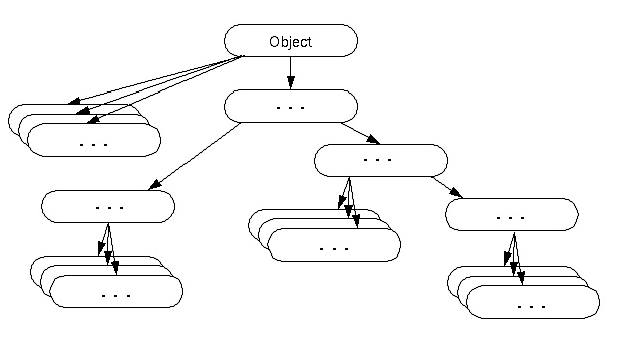
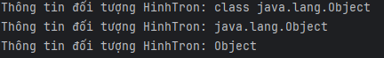
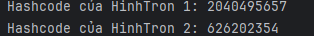
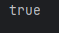
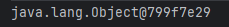
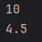

 # Danh mục
- [Danh mục](#danh-mục)
- [***\[BUỔI 3\] CÁCH JAVA LƯU TRỮ DỮ LIỆU***](#buổi-3-cách-java-lưu-trữ-dữ-liệu)
  - [1. Cách  Java lưu trữ dữ liệu](#1-cách--java-lưu-trữ-dữ-liệu)
    - [1.1. Kiểu dữ liệu nguyên thủy](#11-kiểu-dữ-liệu-nguyên-thủy)
    - [1.2. Kiểu dữ liệu đối tượng](#12-kiểu-dữ-liệu-đối-tượng)
    - [1.3. Class Object](#13-class-object)
      - [***1.3.1. public final Class getClass()***](#131-public-final-class-getclass)
      - [***1.3.2. int hashCode()***](#132-int-hashcode)
      - [***1.3.3. boolean equals(Object obj)***](#133-boolean-equalsobject-obj)
      - [***1.3.4. Object clone()***](#134-object-clone)
      - [***1.3.5. String toString()***](#135-string-tostring)
    - [1.4 Lớp Wrapper, Boxing, Unboxing](#14-lớp-wrapper-boxing-unboxing)
      - [***1.4.1. Chuyển  đổi kiểu nguyên thủy sang kiểu Wrapper***](#141-chuyển--đổi-kiểu-nguyên-thủy-sang-kiểu-wrapper)
      - [***1.4.2. Chuyển đổi kiểu Wrapper thành kiểu dữ liệu nguyên thủy***](#142-chuyển-đổi-kiểu-wrapper-thành-kiểu-dữ-liệu-nguyên-thủy)
      - [***1.4.3. Các phương thức hữu ích của lớp Wrapper***](#143-các-phương-thức-hữu-ích-của-lớp-wrapper)
*** 

# ***[BUỔI 3] CÁCH JAVA LƯU TRỮ DỮ LIỆU***

***

## 1. Cách  Java lưu trữ dữ liệu

Trong Java, kiểu dữ liệu được chia làm 2 loại: 
* Kiểu dữ liệu nguyên thủy
* Kiểu đối tượng

>Để phân biệt 2 kiểu này ta dựa vào tên của nó. Kiểu nguyên thủy bắt đầu bằng **chữ thường**, kiểu đối tượng bắt đầu bằng **chữ hoa**.
### 1.1. Kiểu dữ liệu nguyên thủy
- int
- long
- float
- double
- char
- ...

### 1.2. Kiểu dữ liệu đối tượng
- Array
- String
- class: Dữ liệu kiểu lớp đối tượng.
- interface: Dữ liệu kiểu lớp giao tiếp.

>Lưu trữ của các kiểu dữ liệu:
> - Kiểu dữ liệu nguyên thủy: Giá trị là các kiểu dữ liệu cơ sở .
> - Kiểu dữ liệu đối tượng: Giá trị là địa chỉ của đối tượng

### 1.3. Class Object

>*Tài liệu tham khảo*:  [Class Object](http:https://yellowcodebooks.com/2017/08/02/java-bai-24-lop-object/)

Mặc định lớp Object là lớp cha của tất cả các lớp trong Java.



Sử dụng lớp Object là hữu ích nếu bạn muốn tham chiếu bất kỳ đối tượng nào mà bạn chưa biết kiểu dữ liệu của đối tượng đó.

**Ví dụ**: Giả sử phương thức getObject() trả về một đối tượng nhưng nó có thể là bất kỳ kiểu nào như Employee,Student, ... chúng ta có thể sử dụng biến tham chiếu của lớp Object để tham chiếu tới đối tượng đó.
```Java
Object obj = getObject();
```
#### ***1.3.1. public final Class getClass()***
\- Phương thức này trả về lớp ` Class`. Từ lớp Class đó có thể lấy được các thông tin metadata của class hiện tại.
```Java
public class Hinhtron {
    public static void main(String[] args) {
        Object hinhTron = new Object();
        System.out.println("Thông tin đối tượng HinhTron: " + hinhTron.getClass());
        System.out.println("Thông tin đối tượng HinhTron: " + hinhTron.getClass().getName());
        System.out.println("Thông tin đối tượng HinhTron: " + hinhTron.getClass().getSimpleName());
    }
}
```


#### ***1.3.2. int hashCode()***

\- Trả về số hashcode cho đối tượng hiện tại.

```Java
public class Hinhtron {
    public static void main(String[] args) {
        Object hinhTron1 = new Object();
        Object hinhTron2 = new Object();

        System.out.println("Hashcode của HinhTron 1: " + hinhTron1.hashCode());
        System.out.println("Hashcode của HinhTron 2: " + hinhTron2.hashCode());
    }
}
```


#### ***1.3.3. boolean equals(Object obj)***
\- So sánh đối tượng đã cho với đối tượng hiện tại.
```Java
public class Hinhtron {
    public static void main(String[] args) {
        Object hinhTron1 = new Object();
        Object hinhTron2 = hinhTron1;

        System.out.println(hinhTron1.equals(hinhTron2));
    }
}
```


#### ***1.3.4. Object clone()***
\- Phương thức này giúp khởi tạo và trả về một bản sao của đối tượng được gọi. 

#### ***1.3.5. String toString()***
\- Trả về chuỗi ký tự đại diện của đối tượng hiện tại. Nó là sự kết hợp của chuỗi **getClass().getName() + "@" + hashCode()**

```Java
public class Hinhtron {
    public static void main(String[] args) {
        Object hinhTron1 = new Object();

        System.out.println(hinhTron1.toString());
    }
}
```


### 1.4 Lớp Wrapper, Boxing, Unboxing
\- Lớp Wrapper trong java cung cấp cơ chế để chuyển đổi kiểu dữ liệu nguyên thủy thành kiểu đối tượng và từ đối tượng thành kiểu dữ liệu nguyên thủy.
| **Kiểu nguyên thủy** | **Kiểu Wrapper** |
| -------------------- | ---------------- |
| boolean              | Boolean          |
| char                 | Character        |
| byte                 | Byte             |
| short                | Short            |
| int                  | Integer          |
| long                 | Long             |
| float                | Float            |
| double               | Double           |

#### ***1.4.1. Chuyển  đổi kiểu nguyên thủy sang kiểu Wrapper***
\- Việc chuyển đổi một kiểu nguyên thủy sang kiểu Wrapper của nó người ta gọi là **Boxing** (đóng hộp).

```Java
//Các dạng Boxing
int a=100;
Integer i = new Integer(a);
Float f = new Float(4.5);
Charater ch = new Character('a');
Boolean b = new Boolean(true);
```

```Java
// Các dạng Autoboxing
int a = 500;
Integer i = a;
Float f = 4.5f;
Character ch = 'a';
```

#### ***1.4.2. Chuyển đổi kiểu Wrapper thành kiểu dữ liệu nguyên thủy***
\- khi bạn chuyển từ một kiểu Wrapper sang kiểu nguyên thủy của nó người ta gọi là Unboxing (Mở hộp).

```Java
//Cách viết 1
int a = 500;
Integer i = a;
int i2 = i.intValue();
Float f = 4.5f;
float f2 = f.floatValue();
Character ch = 'a';
char ch1 = a.charValue();
```

```Java
// Cách viết 2
int a = 500;
Integer i = a;
int i2 = i;
Float f = 4.5f;
float f2 = f;
Character ch = 'a';
char ch2 = ch;
```

#### ***1.4.3. Các phương thức hữu ích của lớp Wrapper***
>**parseXxx()**

Tham số truyền vào cho phương thức này là 1 chuỗi, kết quả nhận được là một giá trị nguyên thủy của chuỗi truyền vào.
```Java
int i = Integer.parseInt("10");
float f = Float.parseFloat("4.5");

System.out.println(i);
System.out.println(f);
```


>**toString()**
```Java
String s = Integer.toString(10);
System.out.printfln(s);
```
>**xxxValue()**

>**compareTo()**

Với việc bạn gọi **lopWrapper1.compareTo(lopWrapper2)**, thì kết quả sẽ như sau.

– Nếu kết quả của phương thức trả về một số âm, thì lopWrapper1 sẽ có giá trị `nhỏ hơn` lopWrapper2.

– Nếu kết quả của phương thức trả về số 0, thì lopWrapper1 sẽ có giá trị `bằng` với lopWrapper2.

– Nếu kết quả của phương thức trả về một số dương, thì lopWrapper1 sẽ có giá trị `lớn hơn` lopWrapper2.

```Java
Integer i = 50;
Integer i1 = Integer.parseInt("50");
Integer i2 = 52;
Integer i3=30;
System.out.println(i.compareTo(i1));
System.out.println(i.compareTo(i2));
System.out.println(i.compareTo(i3));

```

```Java
0
-1
1
```

>**equals()**


