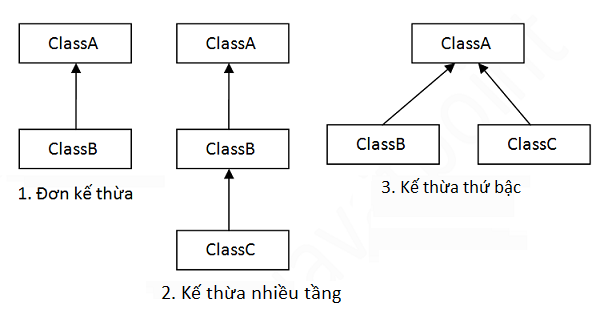

# Danh mục
- [Danh mục](#danh-mục)
- [***[BUỔI 4] MỌI THỨ ĐỀU LÀ ĐỐI TƯỢNG***](#buổi-4-mọi-thứ-đều-là-đối-tượng)
  - [**1. Tính đóng gói trong Java**](#1-tính-đóng-gói-trong-java)
  - [**2. Tính kế thừa trong Java**](#2-tính-kế-thừa-trong-java)
    - [*2.1. Cú pháp kế thừa trong Java*](#21-cú-pháp-kế-thừa-trong-java)
    - [*2.2. Các kiểu kế thừa trong Java*](#22-các-kiểu-kế-thừa-trong-java)
       - [2.2.1. Đơn kế thừa](#221-đơn-kế-thừa)
       - [2.2.2. Kế thừa nhiều cấp](#222-kế-thừa-nhiều-cấp)
       - [2.2.3. Kế thừa thứ bậc](#223-kế-thừa-thứ-bậc)
  - [**3. Tính đa hình trong Java**](#3-tính-đa-hình-trong-java)


***
# *[BUỔI 4] MỌI THỨ ĐỀU LÀ ĐỐI TƯỢNG*
***

## 1. Tính đóng gói trong Java

\- **Tính đóng gói(Encapsulation)** là kỹ thuật **ẩn giấu thông tin không liên quan** và **hiển thị ra thông tin liên quan**.

\- **Mục đích**: Giảm thiểu mức độ phức tạp phát triển phần mềm.

\- Đóng gói cũng được sử dụng để **bảo vệ** trạng thái bên trong của một đối tượng. Việc chỉnh sửa đối tượng được thực hiện, xác nhận thông qua các phương thức.
> Ví dụ: 
```Java
public class Student {
    private String name;
    public void setName(String name){
        this.name = name;
    }
    public String getName(){
        return name;
    }
    public static void main(String[] args){
        Student student = new Student();
        student.setName("Suga");
        System.out.println(student.getName());
    }
}
```

> Suga

- Không thể thay đổi trực tiếp biến `name` nhưng có thể thông qua phương thức công khai `setName` để thay đổi giá trị của chúng và `getName` để lấy ra giá trị của chúng. Điều này đảm bảo *dữ liệu không bị sửa đổi hoặc bị truy cập 1 cách tùy tiện*.

## 2. Tính kế thừa trong Java

\- **Kế thừa trong Java** là sự liên quan giữa 2 class với nhau, trong đó có class **cha** (Superclass) và class **con** (Subclass).

\- Khi kế thừa class con đươc hưởng tất cả các phương thức và thuộc tính của class cha. Tuy nhiên nó chỉ truy cập được các thành viên **public** và **protected** của class cha.
 
 => Kế thừa trong Java là có thể tạo ra một class mới được xây dựng trên các lớp đang tồn tại.

 ### *2.1. Cú pháp kế thừa trong Java*

```Java
class Subclass-name extends Superclass-name{
    //methods and fields
}
```
- ***Example:***
```Java
class Student1{
    private String name;
    Student1 (String name){
        this.name=name;
    }
    public String getName(){
        return name;
    }

}
class Student2 extends Student1{
    private int age;
    Student2 (String name,int age){
        super(name);
        this.age=age;
    }

    public int getAge() {
        return age;
    }
}
public class Student {
    public static void main(String[] args){
        Student2 student = new Student2("Suga",20);
        System.out.println("Name: " + student.getName());
        System.out.println("Age: " + student.getAge());
    }
}
```
> 
```Java
Name: Suga
Age: 20
```
- Trong ví dụ trên thì class `Student2` là con của class `Student1`.

### *2.2. Các kiểu kế thừa trong Java*

Có 3 kiểu kế thừa trong Java:
- Đơn kế thừa
- Kế thừa nhiều cấp
- Kế thừa thứ bậc



#### 2.2.1. Đơn kế thừa
Một lớp con kế thừa với một lớp cha

```Java
class Animal{
    public void Go(){
        System.out.println("go...go ...");
    }
}
class Dog extends Animal{
    public void Sleep(){
        System.out.println("zzz...zzz...");
    }
}
public class Test {
    public static void main(String[] args){
        Dog dog = new Dog();
        dog.Go();
        dog.Sleep();
    }
}
```
>
```Java
go...go ...
zzz...zzz...
```
#### 2.2.2. Kế thừa nhiều cấp
Các lớp nối đuôi nhau kế thừa

```Java
class Animal{
    public void Go(){
        System.out.println("go...go ...");
    }
}
class Dog extends Animal{
    public void Sleep(){
        System.out.println("zzz...zzz...");
    }
}
class BabyDog extends Dog{
    public void Smile(){
        System.out.println("He...He...");
    }
}
public class Test {
    public static void main(String[] args){
        BabyDog babyDog = new BabyDog();
        babyDog.Go();
        babyDog.Sleep();
        babyDog.Smile();
    }
}
```
>
```Java
go...go ...
zzz...zzz...
He...He...
```

#### 2.2.3. Kế thừa thứ bậc
Lớp con cùng kế thừa 1 lớp cha
```Java
class Animal{
    public void Go(){
        System.out.println("go...go ...");
    }
}
class Dog extends Animal{
    public void Sleep(){
        System.out.println("zzz...zzz...");
    }
}
class BabyDog extends Animal{
    public void Smile(){
        System.out.println("He...He...");
    }
}
public class Test {
    public static void main(String[] args){
        BabyDog babyDog = new BabyDog();
        babyDog.Go();
        babyDog.Smile();
    }
}
```
>
```Java
go...go ...
He...He...
```

- Để giảm thiểu sự phức tạp và đơn giản hóa ngôn ngữ, đa kế thừa ko được hỗ trợ trong Java.
    
    **Ví dụ** có 3 lớp A,B,C. Trong đó lớp C kế thừa từ 2 lớp A,B. Giả sử lớp A,B có phương thức giống nhau thì khi gọi nó từ đối tượng lớp con C, sẽ khó xác định là gọi phuong thức của lớp A hay B.

## 3. Tính đa hình trong Java

\- **Đa hình trong Java** là khái niệm mà chúng ta có thể thực hiện một hành động bằng nhiều cách khác nhau.

\- **Đa hình lúc runtime** là quá trình gọi phương thức đã được ghi đè trong thời gian thực thi chương trình. trong quá trình này, một phương thức được ghi đè được gọi thông qua biến tham chiếu của lớp cha.

```Java
class Animal{
    public void Smile(){
        System.out.println("ha.ha.ha");
    }
}
class Dog extends Animal{
    public void Smile(){
        System.out.println("hi.hi.hi");
    }
}
public class Test {
    public static void main(String[] args){
        Animal dog = new Dog();
        dog.Smile();
    }
}
```
>
```Java
hi.hi.hi
```


