# Mục lục
- [1. Version control là gì và tại sao phải cần dùng nó?](#1-version-control-là-gì-và-tại-sao-phải-cần-dùng-nó)
- [2. Khái niệm về Git](#2-khái-niệm-về-git)
    - [*2.1. Repository*](#21-repository)
    - [*2.2. Branch* ](#22-branch)
    - [*2.3. Commit*](#23-commit)
    - [*2.4. Merger*](#24-merge)
    - [*2.5. Pull*](#25-pull)
    - [*2.6. Push*](#26-push)
    - [*2.7. Clone*](#27-clone)
    - [*2.8. Fork*](#28-fork)
- [3. Khi nào cần Pull request? Cách tạo Pull request](#3-khi-nào-cần-pull-request-cách-tạo-pull-request)
    - [*3.1. Khi nào cần Pull request*](#31-khi-nào-cần-pull-request)
    - [*3.2 Vai trò của Pull request*](#32-vai-trò-của-pull-request)
    - [*3.3 Cách tạo Pull request trên github*](#33-cách-tạo-1-pull-request-trên-github)
- [4. UML là gì? Lí do cần vẽ UML? ](#4-uml-là-gì-lí-do-cần-vẽ-uml)
- [5. Mô hình Class Diagram và Activity Diagram](#5-mô-hình-class-diagram-activity-diagram)
    - [*5.1. Class Diagram*](#51-class-diagram)
    - [*5.2. Activity Diagram*](#52-activity-diagram)

***

# ***[BUỔI 5] DEV THÌ KHÔNG CHỈ VIẾT CODE***
***

## 1. Version control là gì và tại sao phải cần dùng nó? 
- **Version Control** (VCS) là hệ thống kiểm soát phiên bản, giúp theo dõi và quản lý các thay đổi đối với hệ thống tập tin. 

    - Nó hỗ trợ người dùng chia sẻ và báo cáo thông tin về những thay đổi trên file hoặc thư mục. 
    - Nó giúp quản lý các hành động thêm, sửa và xóa các tệp và thư mục.

Một số Version control phổ biến bao gồm **Git**, **Mercurial**, và **SVN**. **Git** là một trong những VCS phổ biến nhất, được sử dụng rộng rãi trong cộng đồng phát triển phần mềm.

- **Lý do sử dụng Version Control:**

    - Lưu lại lịch sử các version của bất kỳ thay đổi nào của dự án. Giúp xem lại các sự thay đổi hoặc khôi phục `(revert)`lại sau này.
    - Việc chia sẻ code trở nên dễ dàng hơn, lập trình viên có thể để public cho bất kỳ ai, hoặc private chỉ cho một số người có thẩm quyền có thể truy cập và lấy code về.
  
    
## 2. Khái niệm về Git
>[Tài liệu tham khảo: Khái niệm về Git](https://topdev.vn/blog/git-la-gi/)
- **Git** là một hệ thống quản lý các phiên bản dưới dạng phân tán. **Git** được ra đời ở thời điểm 2005 và trở thành một hệ thống quản lý phiên bản phân tán phổ biến nhất hiện nay. 

\- Về mặt khái niệm, hầu hết các hệ thống khác coi thông tin chúng lưu giữ dưới dạng một tập hợp các file và những thay đổi được thực hiện đối với mỗi file theo thời gian.

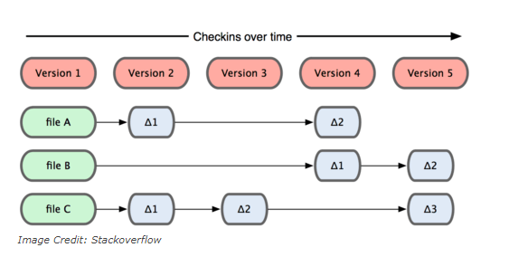

\- **Git** coi thông tin được lưu trữ là một tập hợp các *snapshot* – ảnh chụp toàn bộ nội dung tất cả các file tại thời điểm.

Mỗi khi bạn “commit”, Git sẽ *“chụp”* và tạo ra một snapshot cùng một tham chiếu tới snapshot đó. Để hiệu quả, nếu các tệp không thay đổi, Git sẽ không lưu trữ lại file — chỉ là một liên kết đến tệp giống file trước đó mà nó đã lưu trữ.
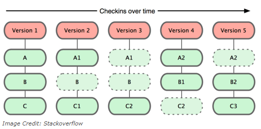

### *2.1. Repository*
- Là nơi lưu trữ tất cả những thông tin cần thiết để duy trì và quản lý các sửa đổi và lịch sử của dự án (nơi trữ source code và các thay đổi trên đống source code này).

- Có 2 loại repository:

    - **Local Repository**: là repository nằm trên chính máy tính của chúng ta, repository này sẽ đồng bộ hóa với remote repository bằng các lệnh của git.
    - **Remote Repository**: là repository được cài đặt trên server chuyên dụng. Ví dụ: GitHub, GitLab, Bitbucket,...
    
- Khi tự khởi tạo một repository, chúng ta gõ lệnh `$ git init`, lệnh này sẽ tạo ra một thư mục `.git` và đây chính là repository còn phần code nằm cùng với thư mục `.git` được gọi là ``Working Directory``.

    `Initialized empty Git repository in path_to_folder/.git/
`
### *2.2. Branch*
- Branch (nhánh) đại diện cho các phiên bản cụ thể của dự án. Những thao tác sẽ được lưu trữ trên nhánh hiện tại, không làm ảnh hưởng đến nhánh cũ.
  
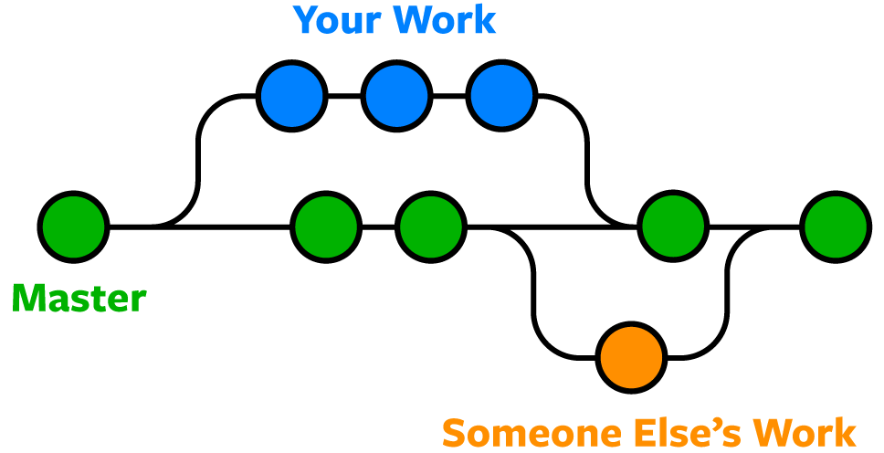

### *2.3. Commit*
- Là thao tác để lưu lại trạng thái hiện tại trên hệ thống, ghi nhận lại lịch sử các xử lý: thêm, xóa, cập nhật các file hay thư mục trên repository.
  
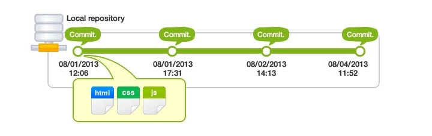

### *2.4. Merge*
- **Git merge** được dùng khi ta muốn gộp hai branch lại với nhau, thao tác này thường dùng để `merge branch` khác vào ``branch master`` trước khi push lên ``remote repository``, hoặc merge hai branch thành một để giải quyết chung một task.

 Câu lệnh: 
```
$ git merge <branch-name>
```
Hoặc:
```
$ git merge <branch-name> <merged-branch-name>
```

### *2.5. Pull*
- Là hành động cập nhật các thay đổi xuống local repo.

**Ví dụ**: Trong khi bạn đang code trên một file thì một người bạn trong nhóm của bạn cũng code trên một file khác cùng branch, người bạn đó hoàn thành công việc, commit và push lên remote repo. Lúc này bạn muốn lấy những thay đổi mà người bạn của bạn đã thực hiện thì bạn sẽ thực hiện hành động Pull xuống.

Câu lệnh:
```
$ git pull origin [name_branch].
```

### *2.6. Push*
- Là hành động đưa những thay đổi đã commit lên một branch nào đó ở `remote repository` hoặc một branch mới hoàn toàn lên `remote repository`. 

```
$ git push origin <name_branch>
```
### *2.7. Clone*
- Sao chép một repository có sẵn về local.
Câu lệnh:
```
git clone /đường-dẫn-đến-repository/
```

### *2.8. Fork*

- Là hành động tạo một bản sao của repository gốc thành một repository của bạn. Việc fork một repository cho phép bạn dễ dàng chỉnh sửa, thay đổi source code mà không ảnh hưởng tới source gốc.
- Khác với `fork`, `clone` nó là một bản remote local copy của một số kho lưu trữ. Khi bạn sao chép, bạn đang sao chép toàn bộ repo, bao gồm tất cả lịch sử và các nhánh.

## 3. Khi nào cần Pull Request? Cách tạo Pull Request
>[Tài liệu tham khảo: Pull request](https://viblo.asia/p/tao-pull-request-dung-cach-bWrZnwkrlxw)

- **Pull Request** là một tính năng của hệ thống quản lý mã nguồn (source control management) như Git, GitHub, hay GitLab. Nó là một cách để người dùng có thể đề xuất thay đổi vào mã nguồn của một dự án đã được lưu trữ trên hệ thống quản lý mã nguồn đó.

-  Pull request bao gồm các thông tin về các thay đổi đã thực hiện, các commit mới, các nhận xét, v.v. Người sở hữu dự án hoặc các thành viên khác của dự án có thể xem và kiểm tra các thay đổi trước khi chấp nhận hoặc từ chối pull request.

### *3.1. Khi nào cần Pull request?*

- Thực tế khi bạn làm việc trong team có nhiều người, mỗi một chức năng bạn hoàn thành code và cần được team review, bạn không thể gọi mọi người đến máy tính của bạn và ngồi đấy review từng dòng code cho bạn đâu nhỉ. Bạn cũng không thể gởi từng file source code cho người review để họ download về máy và review được - quá tốn thời gian và thật sự không chuyên nghiệp. Và tất nhiên khi khách hàng (đang ở một nơi nào đấy rất rất xa bạn) muốn tham gia review code của bạn thì chuyện này càng khó khăn hơn. Đó là lúc cần dùng đến Pull request. Khi một pull request được chấp nhận, các thay đổi được hợp nhất vào branch chính của dự án. 

### *3.2. Vai trò của Pull request*
\- **Đảm bảo chất lượng mã nguồn:** Pull Request giúp đảm bảo rằng tất cả các thay đổi trên mã nguồn đã được xem xét và kiểm tra kỹ lưỡng trước khi hợp nhất vào branch chính. Nhờ đó, giúp tránh được các lỗi và xung đột trong quá trình phát triển.

\- **Giúp đơn giản hóa quy trình kiểm tra code:** Pull Request cho phép người tham gia dự án có thể đóng góp thay đổi vào mã nguồn một cách dễ dàng. Nó cũng giúp đơn giản hóa quy trình kiểm tra và chấp nhận các thay đổi.

\- **Tăng tính minh bạch và sự tham gia của cộng đồng:** Pull Request cho phép cộng đồng tham gia vào quá trình phát triển, giúp tăng sự minh bạch và động lực cho các thành viên khác trong dự án.

\- **Đóng góp vào phát triển dự án:** Pull Request cho phép các nhà phát triển đóng góp ý tưởng mới và thay đổi vào dự án một cách dễ dàng. Nhờ đó, dự án sẽ phát triển một cách nhanh chóng và có tính đột phá hơn.

### *3.3. Cách tạo 1 Pull request trên Github*
- **Bước 1: Fork dự án gốc**

    \- Truy cập vào dự án gốc trên GitHub.

    \- Nhấn vào nút “Fork” ở góc trên bên phải để sao chép dự án vào tài khoản của bạn.

- **Bước 2: Clone dự án về máy**

    \- Truy cập vào repository đã fork trong tài khoản của bạn.
Sao chép URL của repository.

    \- Mở Terminal và sử dụng lệnh `git clone` để clone dự án về máy.
- **Bước 3: Tạo nhánh mới**
    
    \- Mở Terminal trong thư mục dự án đã clone.
    
    \- Sử dụng lệnh `git checkout -b [name_branch]` để tạo và chuyển đổi sang một nhánh mới.

- **Bước 4: Thực hiện thay đổi**

    \- Mở dự án trong trình chỉnh sửa mã nguồn.

    \- Thực hiện các thay đổi cần thiết và lưu lại.

- **Bước 5: Commit và Push**
    
    \- Mở Terminal và sử dụng lệnh `git add . ` để thêm các thay đổi vào danh sách commit.

    \- Sử dụng lệnh `git commit -m "Mô tả commit"` để commit các thay đổi đã thêm.

    \- Sử dụng lệnh `git push origin [name_branch]` để đẩy thay đổi lên repository của bạn trên GitHub.

- **Bước 6: Tạo Pull Request**

    \- Truy cập vào repository của bạn trên GitHub.

    \- Nhấn vào nút **“Compare & pull request”** bên cạnh tên nhánh của bạn.

    \- Điền thông tin cần thiết, mô tả về Pull Request và nhấn **“Create Pull Request“**
    .
- **Bước 7: Kiểm tra và xử lý yêu cầu chỉnh sửa**

- **Bước 8: Pull Request được chấp nhận và merge**

## 4. UML là gì? Lí do cần vẽ UML

- **UML** ( Unified Modeling Language - ngôn ngữ mô hình hóa thống nhất) là một ngôn ngữ mô hình gồm các ký hiệu đồ họa mà các phương pháp hướng đối tượng sử dụng để thiết kế các hệ thống thông tin một cách nhanh chóng.

- **UML** sử dụng một hệ thống ký hiệu thống nhất biểu diễn các Phần tử mô hình (*model elements*). Tập hợp các phần tử mô hình tạo thành các **Sơ đồ UML** (UML diagrams). Có các loại sơ đồ UML chủ yếu sau:

    - *Sơ đồ lớp* (Class Diagram)
    - *Sơ đồ đối tượng* (Object Diagram)
    - *Sơ đồ tình huống sử dụng* (Use Cases Diagram)
    - *Sơ đồ trình tự* (Sequence Diagram)
    - *Sơ đồ cộng tác* (Collaboration Diagram hay là Composite Structure Diagram)
    - *Sơ đồ trạng thái* (State Machine Diagram)
    - *Sơ đồ thành phần* (Component Diagram)
    - *Sơ đồ hoạt động* (Activity Diagram)
    - *Sơ đồ triển khai* (Deployment Diagram)
    - *Sơ đồ gói* (Package Diagram)
    - *Sơ đồ liên lạc* (Communication Diagram)
    - *Sơ đồ tương tác* (Interaction Overview Diagram - UML 2.0)
    - *Sơ đồ phối hợp thời gian* (Timing Diagram - UML 2.0)

- **Lí do cần vẽ UML**:
    - *Hiểu rõ Yêu Cầu*: UML giúp mô tả và hiểu rõ các yêu cầu của hệ thống từ góc độ người quản lý dự án và người sử dụng.
    - *Thiết Kế Hệ Thống*: UML cung cấp các biểu đồ và ký hiệu để thiết kế cấu trúc và cách thức hoạt động của hệ thống.
    - *Giao Tiếp Hiệu Quả*: UML tạo ra một ngôn ngữ chung để mô tả ý tưởng và thiết kế, giúp tăng cường giao tiếp giữa các thành viên trong nhóm phát triển và giữa nhóm phát triển và người quản lý.
    - *Tạo Ra Tài Liệu Hệ Thống*: UML giúp tạo ra tài liệu dự án đồng thời và thực hiện, giúp dễ dàng theo dõi và duy trì hệ thống.
    - *Kiểm Tra và Đánh Giá Thiết Kế*: Các biểu đồ UML, như biểu đồ lớp, biểu đồ tuần tự, và biểu đồ use case, có thể được sử dụng để kiểm tra và đánh giá thiết kế của hệ thống trước khi bắt đầu quá trình phát triển.
    - *Quản Lý Các Yếu Tố Phức Tạp*: UML giúp quản lý sự phức tạp của hệ thống bằng cách tạo ra các mô hình trừu tượng để giảm bớt sự phức tạp và tăng tính rõ ràng.
    - *Phân Chia Công Việc*: UML có thể được sử dụng để phân chia công việc giữa các thành viên trong nhóm phát triển và làm cho mỗi người hiểu rõ vai trò và trách nhiệm của mình.

## 5. Mô hình Class Diagram, Activity Diagram

### *5.1. Class Diagram*

> [Class Diagram](https://vncoder.vn/bai-viet/huong-dan-cach-thiet-ke-so-do-lop-class-diagram-trong-uml)
- **Class diagram** mô tả kiểu của các đối tượng trong hệ thống và các loại quan hệ khác nhau tồn tại giữa chúng.
- ***Các thành phần cơ bản của Class Diagram:***
    - Tên class.
    - Thuộc tính.
    - Phương thức.

    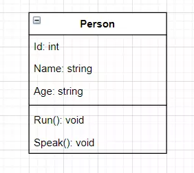

- ***Access Modifier trong Class Diagram***
    - Private ( – )
    - Public ( + )
    - Protected ( # )
    - Package/Default

    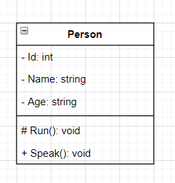

- ***Relationship trong Class Diagram***

    \-  Association: quan hệ giữa hai lớp với nhau, thể hiện chúng có liên quan với nhau.

    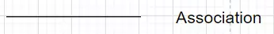

    \- Aggregation: Đối tượng tạo từ class A mất thì đối tượng tạo từ class B vẫn tồn tại độc lập. 

    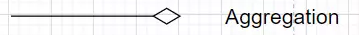

    \- Composition: Đối tượng tạo từ lass A mất thì đối tượng tạo từ class B sẽ mất.
    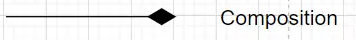

    \- Inheritance: 1 class kế thừa từ 1 class khác.
  
    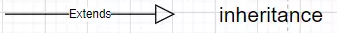

- ***Multiplicity trong Class Diagram***

    Sử dụng để thể hiện quan hệ về số lượng giữa các đối tượng được tạo từ các class trong class diagram.

    - 0…1: 0 hoặc 1
    - n : Bắt buộc có n
    - 0…* : 0 hoặc nhiều
    - 1…* : 1 hoặc nhiều
    - m…n: có tối thiểu là m và tối đa là n

### *5.2. Activity Diagram*
>[Activity Diagram](https://magz.techover.io/2021/08/25/tong-quan-ve-activity-diagram/)
- Là một mô hình logic dùng để mô hình hóa các hoạt động trong một quy trình nghiệp vụ.
- Là sơ đồ luồng xử lí của hệ thống, bao gồm luồng đi của dòng dữ liệu, dòng sự kiện.
- ***Các thành phần của Activity Diagram: ***
    - Start

        
        
        + Khởi tạo một hoạt động.
        + Một activity diagram có thể có nhiều trạng thái Start.
    - Transition:

        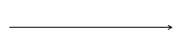

        Mô tả sự chuyển đổi trạng thái của các hoạt động
    - Activity:

        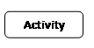

        Mô tả hành vi của đối tượng trong quy trình
    - Branch:

        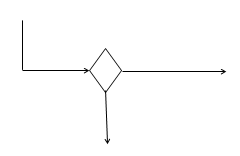
        + Mô tả điều kiện rẽ nhánh
        + Chỉ một dòng điều khiển đi vào
        + Hai hoặc nhiều dòng điều khiển đi ra
        + Chỉ một dòng điều khiển dẫn đến kết quả
        + Mỗi dòng chứa một điều kiện, điều kiện phải liên quan đến điều kiện và loại trừ nhau.
    - Fork:

        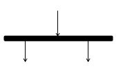
        + Mô tả một dòng điều khiển được tách ra thực hiện song song
        + Chỉ có một dòng điều khiển đi vào
        + Có hai hoặc nhiều dòng điều khiển đi ra
        + Dùng FORK khi các hoạt động thực hiện không quan tâm thứ tự
    - End: 
         
         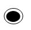
        + Mô tả trạng thái kết thúc quy trình
        + Một Activity Diagram có thể có một hoặc nhiều trạng thái kết thúc.
        


