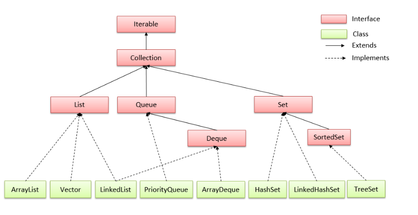
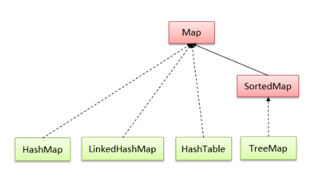
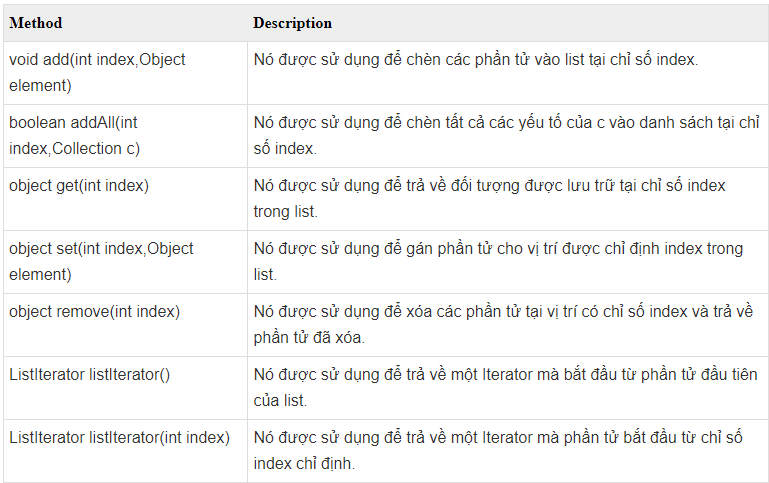
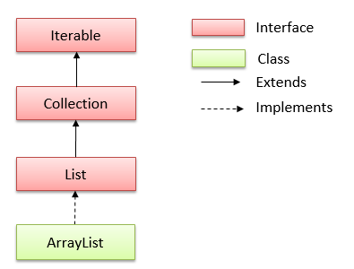
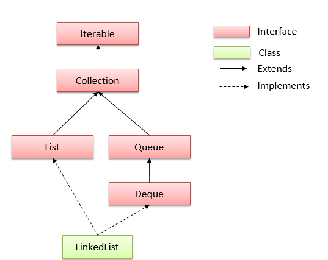
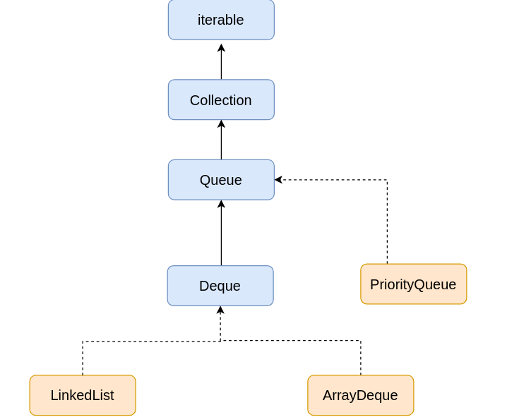
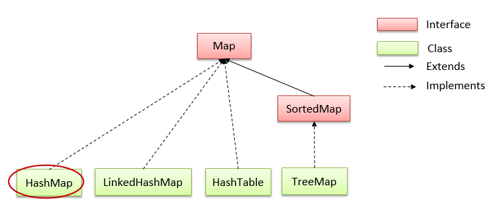
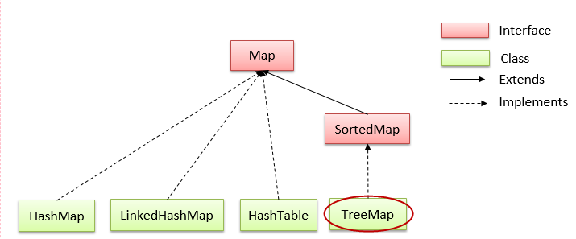

# [BUỔI 8] MỘT SỐ CẤU TRÚC DỮ LIỆU THƯỜNG THẤY TRONG JAVA
---
## **1. Cấu trúc dữ liệu là gì? Sử dụng khi nào?**
> [*Cấu trúc dữ liệu*](https://funix.edu.vn/chia-se-kien-thuc/cau-truc-du-lieu-la-gi-tong-hop-cac-loai-cau-truc-du-lieu/)

\- **Cấu trúc dữ liệu** là một hình thức tổ chức, lưu trữ dữ liệu theo hệ thống và thứ tự để có thể sử dụng tài liệu 1 cách tối ưu. 

\- **Các hoạt động phổ biến trên Cấu trúc dữ liệu**:
- ***Tìm kiếm***: Chúng ta có thể tìm kiếm tất cả các phần tử.
- ***Sắp xếp***: Thực hiên sắp xếp các phần tử theo thứ tự tăng/giảm dần.
- ***Chèn***: Bạn có thể chèn thêm các phần tử mới.
- ***Cập nhật***: Chúng ta có thể thay thế, cập nhật 1 phần tử nào đó trong cấu trúc dữ liệu bằng 1 phânf tử khác.
- ***Xóa***: Loại bỏ phần tử.

\- **Các loại cấu trúc dữ liệu cơ bản**:
- Một số cấu trúc cơ bản như: Integer, Char, Float,... Ngoài ra chúng còn được biết đến với cái tên là cấu trúc dữ liệu nguyên thủy.
- Một số loại cấu trúc phức tạp (trừu tượng):

    + ***Lists***: Danh sách
    + ***Graphs***: Đồ thị, sơ đồ
    + ***Trees***: Cây
    + ***Stacks***: Ngăn xếp

\- **Phân biệt cấu trúc dữ liệu theo đặc tính**:
+ ***Tuyến tính***: Các mục dữ liệu sẽ được sắp xếp theo trình tự tuyến tính (Array).
+ ***Không tuyến tính***: Các mục dữ liệu không được sắp xếp theo trình tự (Trees, Graphs).
+ ***Đồng nhất*** :Các phần tử được sắp xếp đồng nhất (Array).
+ ***Không đồng nhất***: Các dữ liệu được sắp xếp cùng kiểu hoặc không cùng kiểu (Structures).
+ ***Động***: Các dữ liệu có thể thay đổi (List).
+ ***Tĩnh***: Cấu trúc và kích thước được cố định (Array).

\- **Ưu điểm của cấu trúc dữ liệu trong Java**:
- ***Hiệu quả***: được sử dụng để tăng hiệu quả và hiệu suất của ứng dụng bằng cách tổ chức dữ liệu theo cách mà nó cần ít dung lượng hơn với tốc độ xử lý cao hơn.
- ***Khả năng tái sử dụng***: cung cấp khả năng tái sử dụng của dữ liệu, đó là sau khi thực hiện một cấu trúc dữ liệu cụ thể một lần, chúng ta có thể sử dụng nó nhiều lần ở bất kỳ nơi nào khác.
- ***Tính trừu tượng***: Chương trình chỉ sử dụng cấu trúc dữ liệu với sự trợ giúp của Interface mà không cần biết về chi tiết triển khai.
---
## **2. Interface Iterable, Collection**
### ***2.1. Interface Iterable***
> [*Interface_Iterable*](https://websitehcm.com/iterable-trong-java/)

\- Trong Java, **Iterable** là một giao diện (*interface*) được định nghĩa trong gói `java.lang`.

\- **Iterable** chứa một phương thức duy nhất là `Iterator<T> iterator()` cho phép một đối tượng cung cấp một **Iterator** (một đối tượng dùng để lặp qua tất cả các phần tử của nó) cho một vòng lặp `for-each` để lặp qua tất cả các phần tử của nó.

\- **Iterator** cung cấp các phương thức như: 
- `hasNext()`: kiểm tra xem tập hợp có phần tử tiếp theo không.
- `next()`: lấy phần tử tiếp theo.
```Java
public class Main {
    public static void main(String[] args) {
        List<String> danhSach = new ArrayList<>();
        danhSach.add("Happy");
        danhSach.add("New");
        danhSach.add("Year");
        // Sử dụng Iterator để duyệt qua danh sách liên kết
        Iterator<String> iterator = danhSach.iterator();
        while (iterator.hasNext()) {
            String phanTu = iterator.next();
            System.out.println(phanTu);
        }
    }
}
```
```Java
Happy
New
Year
```
### ***2.2. Collection***
> [*Collection*](https://viettuts.vn/java-collection)

\- **Collection** trong java là một *root interface* trong hệ thống cấp bậc Collection. Java Collection cung cấp nhiều *interface*(Set, List, Queue, Deque vv) và các *lớp* (ArrayList, Vector, LinkedList, PriorityQueue, HashSet, LinkedHashSet, TreeSet vv).




### ***2.3. List***
> [*List*](https://viettuts.vn/java-collection/list-trong-java)

\- **List** là một interface trong java. Nó chứa các phương thức để chèn và xóa các phần tử dựa trên chỉ số index.

\- **Các phương thức của List trong Java**:


\- Ví dụ:
```Java
import java.util.ArrayList;
import java.util.List;
 
public class Main {
    public static void main(String args[]) {
        List<String> list = new ArrayList<String>();
        list.add("Đường");
        list.add("về");
        list.add("nhà");
        System.out.println("Phan tu co index = 1 la: " + list.get(1));
        // show list
        for (String s : list) {
            System.out.println(s);
        }
    }
}
```
```Java
Phan tu co index = 1 la: về
Đường 
về 
nhà
```

\- **ArrayList**:
- Có thể chứa các phần tử trùng lặp.
- Duy trì thứ tự của phần tử được thêm vào.
- Là lớp không đồng bộ.
- Cho phép truy cập ngẫu nhiên vì nó lưu dữ liệu theo chỉ mục.
- Thao tác chậm vì cần nhiều sự dịch chuyển nếu bất kỳ phần tử nào bị xoá khỏi danh sách.


\- **LinkedList**:
- Có thể chứa các phần tử trùng lặp.
- Duy trì thứ tự của phần tử được thêm vào.
- Là lớp không đồng bộ.
- Thao tác nhanh vì không cần phải dịch chuyển nếu bất kỳ phần tử nào bị xoá khỏi danh sách.
- Có thể được sử dụng như **list**, **stack**, **queue**.


> Chúng ta sẽ sử dụng **ArrayList** khi chúng ta cần truy xuất phần tử nhiều hơn và chúng ta sẽ sử dụng **LinkedList** khi ứng dụng của chúng ta cần cập nhật và xóa phần tử nhiều hơn. 

### ***2.4. Set***
>[*Set*](https://viettuts.vn/java-collection/set-trong-java)

\- Là một interface kế thừa Collection interface trong java. Set trong java là một Collection **không** thể chứa các phần tử trùng lặp.

\- Set được triển khai bởi **Hashset**, **LinkedHashset**, **Treeset** hoặc **EnumSet**.

- **HashSet**: lưu trữ các phần tử của nó trong bảng băm, là cách thực hiện tốt nhất, tuy nhiên nó không đảm bảo về thứ tự các phần tử được chèn vào.

- **TreeSet**: lưu trữ các phần tử của nó trong một cây, sắp xếp các phần tử của nó dựa trên các giá trị của chúng, về cơ bản là chậm hơn **HashSet**.

- **LinkedHashSet**: được triển khai dưới dạng bảng băm với có cấu trúc dữ liệu danh sách liên kết, sắp xếp các phần tử của nó dựa trên thứ tự chúng được chèn vào tập hợp (thứ tự chèn).

- **EnumSet**: là một cài đặt chuyên biệt để sử dụng với các kiểu enum.

\- Các phương thức: `add`, `addAll`, `remove`, `clear`, `isEmpty`, `size`, `contains`...

\- Ví dụ:
```Java
public class Main {
    public static void main(String[] args) {
        Set<String> set = new HashSet<String>();
        set.add("shooky");
        set.add("rj");
        set.add("tata");
        set.add("koya");
        System.out.println(set.size());
        System.out.println(set.contains("rj"));
    }
}
```
```Java
4
true
```

### ***2.5. Queue***
> [*Queue*](https://techmaster.vn/posts/36831/tat-tan-tat-ve-java-collections-queue-interface-phan-3)


\- **Interface Queue** nằm trong package `java.util` và kế thừa `Collection` interface. Nó được sử dụng để lưu trữ các phần tử được xử lý theo thứ tự **FIFO** (First In First Out).

\- Tương tự **List**, **Queue** là một interface do đó không thể tạo đối tượng từ queue mà phải thông qua các class implements nó như **LinkedList**, **ArrayDeque**, **PriorityQueue**.



\- **Các phương thức trong Queue:**
- `add()`: Thêm phần tử vào Queue.
- `offer()`: Thêm phần tử vào Queue.
- `remove()`, `poll()`:Trả về phần tử đầu tiên và xóa phần tử đó.
- `element()`,`peek()`: Trả về phần tử đầu tiên của queue.

## **3. Interface Map, SortedMap**
>[*Inteface Map*](https://viettuts.vn/java-collection/map-trong-java)

Trong java, **map** được sử dụng để lưu trữ và truy xuất dữ liệu theo cặp **key** và **value**. Mỗi cặp key và value được gọi là *mục nhập* (entry). **Map** trong java chỉ chứa các giá trị key duy nhất. **Map** rất hữu ích nếu bạn phải tìm kiếm, cập nhật hoặc xóa các phần tử trên dựa vào các key.

\- **Một số phương thức của Map Interface:** `put()`, `putAll()`, `remove()`, `get()`, `containsKey()`, `keySet()`(trả đối tượng Set có chứa tất cả các keys), `entrySet()`(trả lại đối tượng Set có chứa tất cả các keys và values).

```Java
public class Main {
    public static void main(String[] args) {
        Map<Integer, String> map = new TreeMap<>();
        map.put(1, "Happy");
        map.put(2, "New");
        map.put(3, "Year");
        System.out.println(map.keySet());
    }
}
```

```Java
1
2
3
```
### ***3.1. HashMap***
>[*HashMap*](https://viettuts.vn/java-collection/hashmap-trong-java)



\- **HashMap** trong java là một lớp kế thừa lớp *AbstractMap* và triển khai của *Map Interface* nên nó sẽ có một vài đặc điểm và phương thức tương đồng với Map. **HashMap** được sử dụng để lưu trữ các phần tử dưới dạng "key/value". Key và value là kiểu dữ liệu bất kỳ, và bạn có thể try cập các giá trị của **HasMap** bằng một key cụ thể.

\- **Những điểm quan trọng về lớp HashMap trong java là:**
- **HashMap** lưu trữ dữ liệu dưới dạng cặp `key` và `value`.
- Nó chứa các `key` duy nhất.
- Nó có thể có 1 `key` là `null` và nhiều giá trị `null`.
- Nó duy trì các phần tử **KHÔNG** theo thứ tự chèn.

```Java
public class Main {
    public static void main(String args[]) {
        HashMap<Integer, String> hashMap = new HashMap<Integer, String>();
        hashMap.put(123, "Phan");
        hashMap.put(11, "Thị");
        hashMap.put(1, "Hồng");
        hashMap.put(44, "Thắm");
        // hien thi HashMap
        System.out.println(hashMap);
    }
}
```

```Java
{1=Hồng, 123=Phan, 11=Thị, 44=Thắm}
```
### ***3.2. TreeMap***
>[TreeMap](https://viettuts.vn/java-collection/treemap-trong-java)



\- Lớp **TreeMap** trong java sẽ có một vài đặc điểm và phương thức tương đồng với **Map** và **SortedMap**.
- **SortedMap** là một interface kế thừa từ **Map interface** có đầy đủ các chức năng mà Map định nghĩa, ngoài ra các phần tử trong **SortedMap** sẽ được **sắp xếp theo thứ tự tăng dần của key**.

\- **Các điểm quan trọng về lớp TreeMap trong java là:**
- **TreeMap** lưu trữ dữ liệu dưới dạng cặp `key` và `value`.
- Nó chứa các `key` duy nhất.
- Nó **KHÔNG** cho phép bất kỳ `key` nào là `null` và nhưng có thể có nhiều giá trị `null`.
- Nó duy trì các phần tử được thêm vào theo thứ tự **key tăng dần**.

```Java
public class Main {
    public static void main(String args[]) {
        TreeMap<String, String> map = new TreeMap<String, String>();
        map.put("J", "Java");
        map.put("C", "C++");
        map.put("P", "PHP");
        map.put("Py", "Python");
        System.out.println(map);
    }
}
```

```Java
{C=C++, J=Java, P=PHP, Py=Python}
```

## **4. Sort**
>[Sort](https://viettuts.vn/java-collection/sorting-trong-collections)

**Lớp Collections** trong java cung cấp các phương thức static để sắp xếp các phần tử của collection. Nếu các phần tử collection thuộc kiểu **Set** hoặc **Map**, chúng ta có thể sử dụng **TreeSet** hoặc **TreeMap**. Nhưng chúng ta không thể sắp xếp các phần tử của **List**. Collections cung cấp phương thức `sort()` để phân sắp xếp các phần tử của **List**.

\- Phương thức `Collections.sort(List)`: được sử dụng để sắp xếp các phần tử của **List**. Với điều kiện các phần tử của **List** phải là kiểu **Comparable**. Nghĩa là lớp các phần tử phải được implements giao diện **Comparable**.

\- Lớp **String** và các lớp **Wrapper** được implements giao diện **Comparable** => áp dụng phương thức `Collections.sort(List list)` mà không phải cài đặt gì thêm, thứ tự ở đây mặc định là tăng dần.
```Java
public class Main {
    public static void main(String args[]) {
        List<String> list = new ArrayList<String>();
        list.add("Java");
        list.add("C");
        list.add("C++");
        list.add("PHP");
        list.add("Python");
        Collections.sort(list);
        for (String element : list) {
            System.out.println(element);
        }
    }
}
```
```Java
C
C++
Java
PHP
Python
```
- **Sắp xếp giảm dần**: Sử dụng `Collections.sort(list, new Comparator<T>())`
```Java
import java.util.ArrayList;
import java.util.Collections;
import java.util.Comparator;
import java.util.List;
public class Main {
    public static void main(String args[]) {
        List<Integer> list = new ArrayList<>();
        list.add(12);
        list.add(15);
        list.add(1);
        list.add(5);
        list.add(147);
        Collections.sort(list, new Comparator<Integer>() {
            @Override
            public int compare(Integer x, Integer y){
                return y.compareTo(x);
            }
        });
        for(Integer x:list){
            System.out.println(x);
        }
    }
}
```
```Java
147
15
12
5
1
```

\- **Đối với các đối tượng người dùng tự định nghĩa:**
- Phải implements giao diện `java.lang.Comparable` để cài đặt phương thức `compareTo()`.
```Java
public class SinhVien implements Comparable<SinhVien>{
    private String name, msv;
    private double gpa;
    public SinhVien() {
    }

    SinhVien(String name, String msv, double gpa){
        this.name=name;
        this.msv=msv;
        this.gpa=gpa;
    }
    public double getGpa(){
        return gpa;
    }

    public String getName() {
        return name;
    }

    public String getMsv() {
        return msv;
    }

    @Override
    public int compareTo(SinhVien sinhVien){
        return Double.compare(this.gpa, sinhVien.getGpa());
    }
}
```
```Java
import java.util.ArrayList;
import java.util.Collections;
import java.util.Comparator;
import java.util.List;
public class Main {
    public static void main(String[] args) {
        // create list students
        List<SinhVien> listSinhVien= new ArrayList<SinhVien>();
        // add students to list
        listSinhVien.add(new SinhVien("Phan", "B22DCCN01",3.4));
        listSinhVien.add(new SinhVien("Thị", "B22DCCN02",2.8));
        listSinhVien.add(new SinhVien("Hồng", "B22DCCN03", 3.8));
        listSinhVien.add(new SinhVien("Thắm", "B22DCCN04", 2.5));
        // sort list student
        Collections.sort(listSinhVien);
        // show list students
        for (SinhVien SV : listSinhVien) {
            System.out.println(SV.getName() + " " + SV.getMsv() + " " + SV.getGpa());
        }
    }
}
```
```Java
Thắm B22DCCN04 2.5
Thị B22DCCN02 2.8
Phan B22DCCN01 3.4
Hồng B22DCCN03 3.8
```
- Tạo đối tượng nặc danh `java.util.Comparator` để cài đặt phương thức `compare()`. Bạn cần phải cài đặt tiêu chí để so sánh trong phương thức `compare()` để so sánh các đối tượng với nhau.
```Java

class SinhVien{
    private String name, msv;
    private double gpa;
    SinhVien(String name, String msv, double gpa){
        this.name=name;
        this.msv=msv;
        this.gpa=gpa;
    }
    public double getGpa(){
        return gpa;
    }

    public String getName() {
        return name;
    }

    public String getMsv() {
        return msv;
    }
}
```
```Java
import java.util.ArrayList;
import java.util.Collections;
import java.util.Comparator;
import java.util.List;
public class Main {
    public static void main(String[] args) {
        // create list students
        List<SinhVien> listSinhVien= new ArrayList<SinhVien>();
        // add students to list
        listSinhVien.add(new SinhVien("Hẹp", "B22DCCN01",3.4));
        listSinhVien.add(new SinhVien("Pi","B22DCCN02",2.8));
        listSinhVien.add(new SinhVien("Niu", "B22DCCN03", 3.8));
        listSinhVien.add(new SinhVien("Dia", "B22DCCN04", 2.5));
        // sort list student
        Collections.sort(listSinhVien, new Comparator<SinhVien>() {
            @Override
            public int compare(SinhVien o1, SinhVien o2) {
                return o1.getName().compareTo(o2.getName());
            }
        });
        // show list students
        for (SinhVien SV : listSinhVien) {
            System.out.println(SV.getName() + " " + SV.getMsv() + " " + SV.getGpa());
        }
    }
}
```
```Java
Dia B22DCCN04 2.5
Hẹp B22DCCN01 3.4
Niu B22DCCN03 3.8
Pi B22DCCN02 2.8
```


