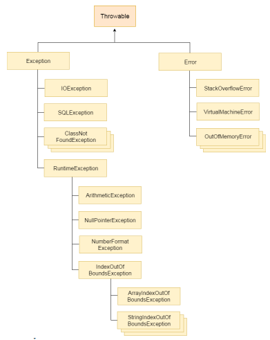
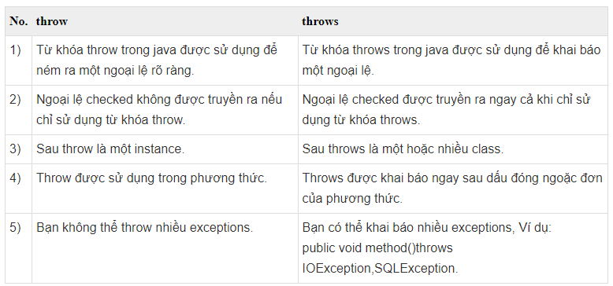

# [BUỔI 9] LUÔN CÓ NGOẠI LỆ, XỬ LÍ NGOẠI LỆ
---
## 1. Làm quen với Exception
\- **Exception** là một sự kiện xảy ra trong quá trình thực thi một chương trình Java, nó làm phá vỡ cái luồng xử lý bình thường của một chương trình, thậm chí chết chương trình.

\- Có 3 lọa **Exception**:
+ Checked Exception
+ Unchecked Exception
+ Error
### 1.1. Checked Exception
- Đây là các ngoại lệ mà chúng ta phải kiểm tra tại thời điểm biên dịch. Loại exception này không thể bỏ qua được trong quá trình compile, bắt buộc ta phải xử lý nó thì mới compile thành công.
- Các ngoại lệ kiểu Checked Exception: `IOException1`, `SQLException`, `FileNotFoundException`,...

### 1.2. Unchecked Exception
- Các ngoại lệ này không được kiểm tra tại thời điểm biên dịch, nhưng được kiểm tra trong thời gian chạy.
- Các ngoại lệ kiểu Unchecked Exception:
    - `NullPointerException`: Xảy ra khi cố gắng truy cập hoặc thao tác với một tham chiếu đối tượng mà trỏ đến `Null`.
    - `NumberFormatException`: Xảy ra khi chuyển một chuỗi thành số, nhưng chuỗi không chuyển được.
    - `ArrayIndexOutOfBoundsException`: Xảy ra khi cố gắng truy cập một phần tử mảng với một id không hợp lệ.
    - `ArithmeticException`: Lỗi số học, ví dụ như chia cho 0.
### 1.3. Error
- Là những vấn đề nghiêm trọng liên quan đến môi trường thực thi của ứng dụng hoặc hệ thống mà lập trình viên không thể kiểm soát. 

---
## 2. Xử lí ngoại lệ
>[Xử lí ngoại lệ](https://gpcoder.com/2430-xu-ly-ngoai-le-trong-java-exception-handling/)

### 2.1. Bắt Exception với `try-catch`
- Cú pháp:
```Java
try{
    // code có thể ném ra ngoại lệ
}catch(Exception_class_Name ref){
    // code xử lí ngoại lệ
}
```

- Ví dụ:
```Java
public class Main {
    public static void main(String[] args) {
        int ex = 10/0;
        System.out.println("Chia cho 0");
    }
}
```

```Java
Exception in thread "main" java.lang.ArithmeticException: / by zero
	at Main.main(Main.java:4)

```
Giải quyết bằng xử lí ngoại lệ:
```Java
public class Main {
    public static void main(String[] args) {
        try{
            int ex = 10/0;
        }catch(ArithmeticException a){
            System.out.println(a);
        }
        System.out.println("Chia cho 0");
    }
}
```
```Java
java.lang.ArithmeticException: / by zero
Chia cho 0
```

### 2.2. Từ khóa `finally`
- Cú pháp:
```Java
try {
    // Đoạn mã có thể gây ra ngoại lệ
} catch (ExceptionType e) {
    // Xử lý ngoại lệ
} finally {
    // Mã trong khối finally
}
```
Khối lệnh `finally` trong java luôn được thực thi cho dù có ngoại lệ xảy ra hay không. Chương trình sẽ thực thi câu lệnh đầu tiên của khối `finally` ngay sau khi gặp câu lệnh `return` hay lệnh `break` trong khối `try`.
- **Vd1**: sử dụng khối lệnh `finally` nơi ngoại lệ không xảy ra.
```Java
public class Main {
    public static void main(String[] args) {
        try{
            int ex = 10/5;
            System.out.println(ex);
        }catch(NullPointerException n){
            System.out.println(n);
        }finally {
            System.out.println("Khối finally luôn được thực hiện");
        }

        System.out.println("Finish");
    }
}
```
```Java
2
Khối finally luôn được thực hiện
Finish
```

- **Vd2**: sử dụng khối lệnh `finally` nơi ngoại lệ xảy ra nhưng không xử lý.
```Java
public class Main {
    public static void main(String[] args) {
        try{
            int ex = 10/0;
            System.out.println(ex);
        }catch(NullPointerException n){
            System.out.println(n);
        }finally {
            System.out.println("Khối finally luôn được thực hiện");
        }

        System.out.println("Finish");
    }
}
```
```Java
Khối finally luôn được thực hiện
Exception in thread "main" java.lang.ArithmeticException: / by zero
	at Main.main(Main.java:5)
```

- **Vd3**: sử dụng khối lệnh `finally` nơi ngoại lệ xảy ra và được xử lý.
```Java
public class Main {
    public static void main(String[] args) {
        try{
            int ex = 10/0;
            System.out.println(ex);
        }catch(ArithmeticException a){
            System.out.println(a);
        }finally {
            System.out.println("Khối finally luôn được thực hiện");
        }
        System.out.println("Finish");
    }
}
```
```Java
java.lang.ArithmeticException: / by zero
Khối finally luôn được thực hiện
Finish
```
- **Vd4**: Sử dụng khối lệnh `finally` trong trường hợp trong khối try có lệnh `return`.
```Java
public class Main {
    public static void main(String[] args) {
        try{
            int ex = 10;
            if(10%2==0){
                System.out.println(ex);
                return;
            }
        }catch(ArithmeticException a){
            System.out.println(a);
        }finally {
            System.out.println("Khối finally luôn được thực hiện");
        }
        System.out.println("Finish");
    }
}
```
```Java
10
Khối finally luôn được thực hiện
```
## 3. Cây phân cấp Exception, phân biệt `throw` và `throws`
### 3.1. Cây phân cấp Exception

### 3.2. Từ khóa `throws`
> [Throws](https://viettuts.vn/exception-handling/tu-khoa-throws-trong-java)

\- Từ khóa `throws` được sử dụng để khai báo một ngoại lệ để nói rằng phương thức có thể gây ra 1 hay nhiều loại Exception.

\- Cú pháp:
```Java
return_type method_name() throws exception_class_name {  
    / /method code
}
```

### 3.3. Từ khóa `throw`
>[throw](https://viettuts.vn/exception-handling/tu-khoa-throw-trong-java)

\- Từ khoá `throw` được sử dụng để ném ra một ngoại lệ cụ thể.

\- Chúng ta có thể ném một trong hai ngoại lệ checked hoặc unchecked trong java bằng từ khóa `throw`. Từ khóa `throw` chủ yếu được sử dụng để ném ngoại lệ tùy chỉnh (ngoại lệ do người dùng tự định nghĩa).
\- Cú pháp:
```Java
throw exception;
```
```Java
throw new IOException("File không tồn tại");
```
\- Ví dụ: 
```Java
public class Main {
    static int test (int a, int b){
        if(b==0){
            throw new ArithmeticException("Không chia được");
        }
        else return a/b;
    }
    public static void main(String[] args){
        try{
            int c = test(5,0);
            System.out.println(c);
        }
        catch(ArithmeticException e){
            System.out.println(e);
        }
    }
}
```
```Java
java.lang.ArithmeticException: Không chia được
```
### 3.4. Phân biệt `throw` và `throws`


## 4. Tạo ra Exception
```Java
\\File: InvalidageException
class InvalidAgeException extends Exception{
    InvalidAgeException(String s){
        super(s);
    }
}
```
```Java
\\File: Main
import java.io.IOException;

public class Main {
    static void test(int age) throws InvalidAgeException{
        if(age<18){
            throw new InvalidAgeException("Chưa đủ cái tuổi");
        }
    }
    public static void main(String[] args) throws InvalidAgeException {
        try{
            test(15);
        }
        catch(InvalidAgeException e){
            System.out.println("Bắt ngoại lệ: " + e);
        }
        System.out.println("Kết thúc");
    }
}
```
```Java
Bắt ngoại lệ: InvalidAgeException: Chưa đủ cái tuổi
Kết thúc
```